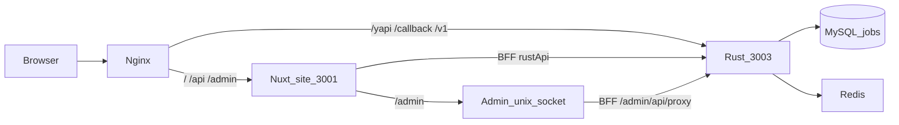

# 整机地图（后续对话先读）

招聘系统：**PHP 页面已切走**，现行是 Rust API + Nuxt 4（PC/H5 + admin）。`uploads/` 是冷备份 / 只读对照，**运行时禁止** `read_to_string` / `publicAssets` 指过去；用户文件在 `storage/upload/`。**不要改 PHP 业务代码**。

长文拓扑与路径表见 [doc/ARCHITECTURE.md](../../doc/ARCHITECTURE.md)。编译 / 重启见 [rust/run.md](./rust/run.md)。加功能配方见 [dev-playbook.md](./dev-playbook.md)。

## 仓库地图

| 目录 | 干什么 |
|---|---|
| `phpyun-rs/` | Rust axum API（唯一 binary `phpyun-rs`） |
| `web/apps/site` | Nuxt 4 SSR：PC + H5 + 会员中心；现网 Web TCP **`:3001`** |
| `web/apps/admin` | Nuxt 4 SPA（`ssr: false`，`baseURL=/admin/`）；现网 **unix socket** |
| `web/layers/{base,ui}` | 共享 BFF / auth / 组件 |
| `uploads/` | 旧 PHP 冷备份 / 只读对照；运行时不要打开 |
| `storage/upload/` | 用户文件（头像/证照/新闻图）；gitignore，不进仓库 |
| `ops/` | 现网 systemd / nginx 样例 / `restart.sh` |
| `doc/` | 架构长文、契约快照、历史方案 |
| `.cursor/docs/` | **给 Cursor / 后续对话的精炼口径**（本文所在） |

## 三进程

| 进程 | 监听 | 库 / 依赖 | 谁用 |
|---|---|---|---|
| `test-jobs-phpyun-rs-3003` | **`:3003`**，metrics **`:9091`** | MySQL **jobs** + Redis | Site BFF、Admin BFF、`/yapi/`、`/callback/`、`/v1` |
| `test-jobs-phpyun-site` | **`:3001`** | 经 `RUST_API_URL` → `:3003` | 公网页 + 把 `/admin` 转到 admin socket |
| `test-jobs-phpyun-admin` | unix `/var/tmp/phpyun-admin.sock` | 同上 | `/admin/` SPA + `/admin/api/*` |

**禁止再启：** 旧 Rust `:3000`（`test-jobs-phpyun-rs`）、admin-edge、`:3002` / `:3004` / `:3005`（`:3002` 仅本机 `pnpm dev:admin`）。



## nginx 路径（现网口径）

样例：[ops/nginx/zzzz.com.nuxt-cutover.conf](../../ops/nginx/zzzz.com.nuxt-cutover.conf)。

| location | 上游 |
|---|---|
| `/` `/api/` `/admin/` | `:3001` site（`/admin` 再转 unix socket） |
| `/yapi/`（剥前缀）`/v1/` `/v2/` `/health` `/ready` `/callback/` | `:3003` |
| `/data/upload/` | `storage/upload/`（nginx alias；job1 无 nginx 时由 site Nitro 运行时读盘） |

浏览器**不**直连 `:3003` 调业务（除 Flutter `/yapi/`、支付回调）。PC/H5 走 `/api/proxy/...`，后台走 `/admin/api/proxy/...`。

## PC / H5 / admin 不是三个应用

- **PC 与 H5**：同一套 `web/apps/site` 路由；模板双写 `.site-pc` / `.site-h5`，CSS `@media (min-width: 1200px)` 切皮。
- **Admin**：独立 app；现网不占 TCP，由 site 托管入口。
- 细节：[web/README.md](./web/README.md)、[web/admin.md](./web/admin.md)。

## API 前缀

| 前缀 | crate（包名） | 谁用 | 契约 |
|---|---|---|---|
| `/v1/wap` `/v1/mcenter` | `phpyun-handlers` | Flutter + 前台 Nuxt | **只加法** |
| `/v2/*` | handlers | 破坏性（如 login 形状） | 新版本 nest |
| `/v1/admin` | `phpyun-api-admin` | 管理后台 | 具名路径；禁止万能 `invoke` |
| `/callback/*` | handlers | 支付 / Locoy | 非信封 JSON |

路径清单以 [doc/snapshots/](../../doc/snapshots/) 为准，不要把全文抄进文档。信封与分页见 [rust/api.md](./rust/api.md)。分层见 [rust/crates.md](./rust/crates.md)。

## Env 选哪份

| 文件 | 用途 |
|---|---|
| `phpyun-rs/.env` | 现网 unit（`PHPYUN_ENV_FILE`），库 **jobs** |
| `phpyun-rs/.env.dev` | 本机 / 测试库（常为 `phpyun_test`） |
| `phpyun-rs/.env.pro` | release 默认 |
| `web/apps/site/.env` | `RUST_API_URL` / `NUXT_RUST_API` / `NUXT_PUBLIC_SITE_URL` / `COOKIE_SECURE` |

`APP_ENV` 只能是 `dev` / `test` / `prod`。改业务只写库 **jobs**，文本列 **utf8mb4**。表前缀：`phpyun_*` 与 PHP 共享；`phpyun_rs_*` 才是 Rust 新表。

## 日常重启

```bash
ops/restart.sh                 # rust + site + admin
ops/restart.sh rust --build    # 编译后再重启 :3003
ops/restart.sh status
```

探活：`curl -i http://127.0.0.1:3003/health`。细节与磁盘注意见 [rust/run.md](./rust/run.md)。

## 禁做清单（硬边界）

- 改接口只动 `phpyun-rs/`；改页面只动 `web/`；**不改** `uploads/` 控制器 / Smarty / 后台 Vue 源码
- 运行时不要读 `uploads/`（皮肤在 `web/apps/site/public/legacy`，用户文件在 `storage/upload`）
- 不起旧 `:3000`；现网 Web TCP 只有 `:3001`
- `/v1/wap` + `/v1/mcenter` 只加法；后台不要塞进 App 契约；不要 `POST /v1/admin/invoke`
- Handler 禁止 `sqlx` / `redis` / `moka` / `reqwest` / 业务规则（见 `rust-code.mdc`）
- 标识符 / SQL / 富文本见 `api-naming.mdc`、`utf8.mdc`
- `ops/T14_RETIRE_PHP.md` 文内仍写 admin `:3002` 的段落 **已过时**；以本文与 ARCHITECTURE / 现行 systemd 为准

## 后续对话读什么

| 要做的事 | 先读 |
|---|---|
| 弄清整机 / 端口 | 本文 → [doc/ARCHITECTURE.md](../../doc/ARCHITECTURE.md) |
| 改 Rust 接口 | [rust/README.md](./rust/README.md) → [crates.md](./rust/crates.md) → [api.md](./rust/api.md) |
| 改 PC/H5 / 会员 | [web/README.md](./web/README.md) → [web/routes.md](./web/routes.md) → [features/member-center.md](./features/member-center.md) |
| 改管理后台 | [web/admin.md](./web/admin.md) → [doc/ADMIN_PHP_TO_NUXT.md](../../doc/ADMIN_PHP_TO_NUXT.md) |
| 端到端加功能 | [dev-playbook.md](./dev-playbook.md) |
| 鉴权 / 缓存 / i18n | [rust/security.md](./rust/security.md)、[cache.md](./rust/cache.md)、[i18n.md](./rust/i18n.md) |

**不要当现状清单：** `PROJECT_PLAN.md`、`doc/FRONTEND_BACKEND_SPLIT.md`（文内「现状」过时）、`doc/API_GAP.md` / `ADMIN_PROGRESS.md`（条数过期）、`.cursor/plans/`（某次执行稿）。
