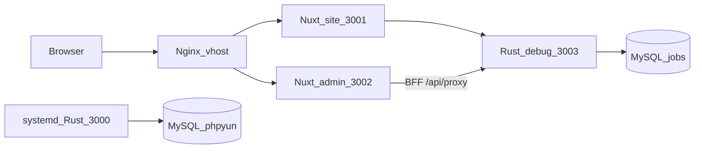

# 当前做到哪里了（Admin Nuxt + Rust API + 伪删除）

## 文档落盘约定（本次起）

Cursor 默认把 plan 写在用户目录 `~/.cursor/plans/`，**仓库里的** [`.cursor/plans/`](.cursor/plans/) 要 **git 提交**（和 `.cursor/rules/` 一样），不要 ignore。

| 文件 | 用途 |
|---|---|
| [`.cursor/plans/*.plan.md`](.cursor/plans/) | Cursor plan 原文，**进 git**。出 plan 后把文件拷进仓库该目录再 commit。 |
| [`doc/ADMIN_PROGRESS.md`](doc/ADMIN_PROGRESS.md) | **活文档**：后台做到哪、伪删除范围、下一项。每次大块完成后改状态表。 |
| [`doc/plans/`](doc/plans/) | 给人看的实施稿：`YYYY-MM-DD-短名.md`（去掉 Cursor frontmatter 亦可）。 |
| [`doc/FRONTEND_BACKEND_SPLIT.md`](doc/FRONTEND_BACKEND_SPLIT.md) | 总方案 T0–T14；进度节链到 `ADMIN_PROGRESS.md`。 |
| [`doc/ADMIN_PHP_TO_NUXT.md`](doc/ADMIN_PHP_TO_NUXT.md) | T11 UI 约定；文首链到 `ADMIN_PROGRESS.md`。 |

规则：

- 每次 plan：**仓库 `.cursor/plans/` + `doc/plans/`** 都要有；现状类再更新 `ADMIN_PROGRESS.md`。
- `.gitignore` **不要**加 `.cursor/` 或 `.cursor/plans/`。
- 不把 `~/.cursor/plans/` 当唯一存档。

**执行本 plan 的第一步**：把下面整份现状写入 `doc/ADMIN_PROGRESS.md`；把本文件拷到仓库 `.cursor/plans/`；两份旧文档加链接；`git commit` + push（含 `.cursor/plans/`）。

分支 [`feat/frontend-backend-split`](feat/frontend-backend-split)，HEAD **`bc694820`**（已 push）。文档 [`doc/FRONTEND_BACKEND_SPLIT.md`](doc/FRONTEND_BACKEND_SPLIT.md) 的 T0–T14 勾选偏旧（仍写「72 条 admin」），以 git 与运行端口为准。

## 运行时（现网验收口）

本机现在有 **两份 phpyun-rs 进程、共 4 个监听口**（每个进程：业务 HTTP + Prometheus metrics）。`.env` 默认 `BIND=127.0.0.1:3000`、`METRICS_BIND=127.0.0.1:9090`；本仓库 debug 启动时用环境变量改绑，避免和 systemd 撞口。

| 进程 | HTTP | Metrics | 二进制 | 库 | 谁在用 |
|---|---|---|---|---|---|
| systemd `test-jobs-phpyun-rs` pid 896785 | **`:3000`** | **`:9090`** | `/opt/phpyun-rs/phpyun-rs` | 原库 phpyun（`.env` 未覆盖时） | 旧栈 / 部分 nginx 仍指这里。**禁止 kill/重启/替换** |
| 本仓库 debug pid 1348265 | **`:3003`** | **`:9091`** | `phpyun-rs/target/debug/phpyun-rs` | **jobs**（`PHPYUN_ENV_FILE=.env` + `BIND`/`METRICS_BIND` 覆盖） | Admin/Site Nitro `RUST_API_URL` |

不是 phpyun-rs、但是同一套验收口：

| 端口 | 进程 | 作用 |
|---|---|---|
| `:3001` | Node Nitro | 前台 site |
| `:3002` | Node Nitro | 管理后台 admin |

调用链不变：Vue `httpPost('m=&c=&a=')` → [`web/apps/admin/app/utils/phpMap.ts`](web/apps/admin/app/utils/phpMap.ts) → BFF `/api/proxy` → **`:3003`** `POST /v1/admin/*`。没有万能 invoke。

## Admin 管理后台（Nuxt）——壳已齐，部分页仍是列表级映射

- [`web/apps/admin/app/pages/`](web/apps/admin/app/pages/)：**121** 个 path 页，对齐 PHP `router.js`。
- UI 源：[`web/apps/admin/app/admin-php/`](web/apps/admin/app/admin-php/)（PHP Vue 语法迁入）。
- 约定：[`doc/ADMIN_PHP_TO_NUXT.md`](doc/ADMIN_PHP_TO_NUXT.md)。
- `phpMap`：大量具名 `m/c/a` + `MODULE_ROUTES` 的 list/save/del/status 回落。具名 action **禁止**静默落到 list（`904fff4b`）。
- 刻意不做：校园/猎头/培训/spview、`database`/`generate_*`/`admin_uc`。

## Rust 后台 API —— OpenAPI 297 + 一批不进快照的 `php-*`

- Crate：[`phpyun-rs/crates/products/recruit/api-admin`](phpyun-rs/crates/products/recruit/api-admin)（约 48 个 `v1/*.rs`）。
- 快照仍锁 **297** 条（[`doc/snapshots/admin_paths.txt`](doc/snapshots/admin_paths.txt)）。近期 PHP 同构接口多是 `php-seo`、`php-add` 这类，**故意不进 AdminDoc**，避免改快照。
- `852b7792` 起后台写库只打 **jobs**，不写 **phpyun**。
- 已按 PHP 补完的主路径（最近 7 个 commit）：企业校验/开户/编辑/Imitate/套餐/comcert、职位 add、简历/会员 add-edit-save、SEO/注册设置/短信/海报形状、公告 add 的 GET 表单。

## 伪删除 —— 已上，但不是全表

提交 **`9e129225`**：

1. **二次校验**：[`delete_guard.rs`](phpyun-rs/crates/products/recruit/api-admin/src/delete_guard.rs) 对路径以 `/delete`、`/purge` 结尾的请求，除 JWT `usertype=3` 外再查 `phpyun_admin_user` 是否仍有效。
2. **标记删除**：[`soft_delete.rs`](phpyun-rs/crates/products/recruit/models/src/soft_delete.rs) 白名单约 39 张表，`deleted=1`；列表用 `COALESCE(deleted,0)=0`。
3. **加列迁移**：[`20260829000001_admin_soft_delete.sql`](phpyun-rs/migrations/sqlx/20260829000001_admin_soft_delete.sql)（公告、新闻、问答、公招、展位、分类等）。

仍用**物理 DELETE**或业务状态位、不走 `deleted` 的例子：

- 职位：`state=2` 下架（PHP 惯例），另有部分 `DELETE FROM phpyun_company_job`
- 会员/企业账号：`DELETE` member/company（注销类）
- KV：`phpyun_admin_config`、银行卡、海报模板 `phpyun_admin_jobwhb`
- 日志/回收站 purge、会话、收藏等
- **招聘会主表 `phpyun_zhaopinhui` 未进白名单**（只有 `phpyun_zhaopinhui_space`）

回收站 [`/v1/admin/recycle-bin`](phpyun-rs/crates/products/recruit/api-admin/src/v1/recycle.rs) 仍是 PHP 那套 recycle 表，不是这套 `deleted` 列的还原器。

## 按 PHP 补接口：停在内容运营写路径之前

| 块 | 状态 |
|---|---|
| 企业/职位/简历会员写 | 完成 |
| SEO / 注册设置 / 短信 / 海报 / 公告 add GET | 完成（`bc694820`） |
| **招聘会 / 新闻 / 问答 / 专题具名 action** | **未做** |
| 前台 OAuth 回调 + 支付真单 | 未做（计划排在后台主路径之后） |

招聘会页 Vue 已打出约 20+ 个 `a=`（`add`/`com`/`audit`/`getjoblist`/`comxls`…），phpMap 目前基本只有 **`/v1/admin/fairs` 列表**。新闻 `addnews`/`group`、问答 `add`/`save`/`getanswer`、专题 `add`/`setOrder` 同类：列表或通用 save 有，PHP 表单形状没有。

## 仍弱或故意不做（避免把 T14 勾选理解成 1:1）

- RBAC 不解析 `group_power`；导出是 CSV 不是 OLE xls
- 微信自定义菜单表迁了 wx-nav，复杂菜单能力仍薄
- 支付回调 handler 在，**沙箱真单未验收**；小程序登录 URL 在、未测拉职位
- php-fpm **未卸**，`uploads/` **未删**（规格只读）
- 测公告 add 留了一行 jobs 里 `id=2` 已 `deleted=1`（列表不可见）
