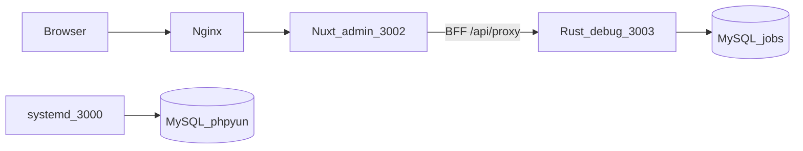

# Admin 现状：Nuxt + Rust API + 伪删除

细进度以 [`doc/ADMIN_PROGRESS.md`](../../doc/ADMIN_PROGRESS.md) 为准。[`doc/FRONTEND_BACKEND_SPLIT.md`](../../doc/FRONTEND_BACKEND_SPLIT.md) 的 T0–T14 勾选偏旧（T11 写成「118 页骨架完成」），不要只看那张总表。

分支：`feat/frontend-backend-split`。本波实现已推到 `d03fe9f6`。本文件是 `d03fe9f6` 之后的现状快照（仓库双写，不替代活文档）。

## 大框架（T0–T14）

- **T0–T13**：按方案文末备注做过验收（crate 拆分、OpenAPI 快照、前台/会员主路径、后台 Nuxt 骨架、回调/locoy、文档）。
- **T14**：本 vhost 页面已切 Nuxt + Rust（不再 fastcgi）。**未**停 php-fpm、**未**删 `uploads/`。
- 前台招聘主路径、会员中心主路径可用。支付：支付宝页跳已接，沙箱真单未跑；微信收款未接。

## 运行时（两套 Rust，勿混）

| 进程 | 端口 | 库 | 说明 |
|---|---|---|---|
| systemd | `:3000` / `:9090` | phpyun | 旧栈，禁止 kill/重启 |
| 本仓库 debug | `:3003` / `:9091` | **jobs** | Admin/Site 实际打这里 |
| Nuxt | `:3001` site、`:3002` admin | — | BFF `/api/proxy` → `:3003` |

调用链：Vue `httpPost('m=&c=&a=')` → [`web/apps/admin/app/utils/phpMap.ts`](../../web/apps/admin/app/utils/phpMap.ts) → BFF → `POST /v1/admin/*`。没有万能 invoke。业务只写 **jobs**。

## Admin Nuxt

- [`web/apps/admin/app/pages/`](../../web/apps/admin/app/pages/)：**121** 个 path，对齐 PHP `router.js`。
- UI 在 [`web/apps/admin/app/admin-php/`](../../web/apps/admin/app/admin-php/)（PHP Vue 语法迁入）。
- 具名 action 必须精确映射，禁止静默落到 list。内容/运营/财务/微聘等走 `phpContent` → `POST /v1/admin/php-content/{module}/{action}`。
- 入口 handler：[php_content.rs](../../phpyun-rs/crates/products/recruit/api-admin/src/v1/php_content.rs)；实现：[admin_php_content_service.rs](../../phpyun-rs/crates/products/recruit/services/src/admin_php_content_service.rs)。**不进 AdminDoc**，OpenAPI 快照仍 **297** 条（[`doc/snapshots/admin_paths.txt`](../../doc/snapshots/admin_paths.txt)）。

## 已按 PHP 补上的后台能力

| 块 | 状态 |
|---|---|
| 企业/职位/简历会员写、SEO/注册/短信/海报、公告 add | 完成（显式 `/v1/admin/*`） |
| 招聘会 / 新闻 / 问答 / 专题 | php-content 完成 |
| 公招 / 公告剩余 | 完成 |
| 广告位 / 广告分类 | 完成（修过 del→create、错表；广告 `is_open=2`） |
| 财务订单/消费/充值 | 完成（凭证上传 → `upload_not_supported`；xls=CSV） |
| 微聘 once/tiny 定价档与设置 | 完成（once `del` 不再误打审核） |
| 兼职 show/audit/推荐/延期/刷新/删除 | 完成（`checkstate` 走上下架，不走审核） |
| 名企 save | 完成（接到已有 `upsert_hotjob`） |
| 简历 skill/project/other | 完成 |
| 单页 | 完成（改走 `phpyun_description`，不再映新闻） |
| 职位分类 ajax / 微信 savenav / 招聘会 comxls | 完成（savenav 成功码 **error=3**） |

php-content 已接 module：`fairs` `news` `gongzhao` `announce` `ads` `ad-class` `question` `special` `once` `tiny` `part` `hotjob` `resume` `pages` `job-class` `wx-nav` `finance-*`。

## 伪删除

提交 `9e129225` + 招聘会/专题主表 `08a6bf99`。

- 约 **41** 张表白名单 `deleted=1`，列表 `COALESCE(deleted,0)=0`。表名单在 [`soft_delete.rs`](../../phpyun-rs/crates/products/recruit/models/src/soft_delete.rs)（含 `phpyun_zhaopinhui`、`phpyun_special`、`phpyun_description`、`phpyun_wxnav` 等）。
- `/delete`、`/purge` 会再查管理员是否有效。
- **仍物理删或业务位**：职位 `state=2`、会员/企业注销、财务订单/消费、KV/日志、回收站 purge。广告 `is_open=2`。
- 回收站 `/v1/admin/recycle-bin` 仍是 PHP recycle 表，不是 `deleted` 列还原器。

## 仍弱 / 下一批 / 刻意不做

**下一批（文档已排队）**

- 兼职/once **图片上传栈**（现无 storage 则 `upload_not_supported`）
- 微信 **creatnav** 调微信 API（savenav 本地菜单已接，同步服务器未接）
- 其余 system 分类（城市/行业等）多数仍是 list 启发式，只有职位分类 ajax 收口

**仍弱**

- RBAC 不解析 `group_power`
- 导出是 CSV 不是 OLE xls
- 微信菜单 `a=index`/`a=save` 仍可能落到 wx-nav 列表/upsert（配置页与菜单表混用启发式）
- 新闻分组树拼法较糙

**刻意不做**

- 校园 / 猎头 / 培训 / spview
- `database` / `generate_*` / `admin_uc`
- 卸 php-fpm、删 `uploads/`
- 沙箱真实付款验收

## 和「已经能用」的差别

页面骨架（121 path）早就在；缺口主要是 **具名 PHP action 是否打到正确 Rust**。招聘/内容/财务/微聘主路径多数已精确映射。未映射的 `httpPost` 会返回「未映射的后台接口」，不会再静默打到列表。
