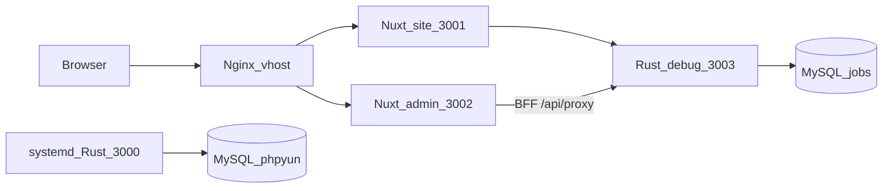

# 管理后台进度（Admin Nuxt + Rust API + 伪删除）

> 2026-08-31 · 分支 `feat/frontend-backend-split`  
> 总方案：[FRONTEND_BACKEND_SPLIT.md](./FRONTEND_BACKEND_SPLIT.md)（T0–T14 勾选偏旧，细进度以本文为准）  
> UI 约定：[ADMIN_PHP_TO_NUXT.md](./ADMIN_PHP_TO_NUXT.md)  
> **缺口与下一轮接法（主稿）**：[plans/2026-08-31-admin-gap.md](./plans/2026-08-31-admin-gap.md)（全量未映射名单 + 波次 1–4 步骤；本文不重复粘贴）  
> Cursor plan 原文：[`.cursor/plans/admin_现状盘点.plan.md`](../.cursor/plans/admin_现状盘点.plan.md)（上午）、[`.cursor/plans/admin_现状盘点_晚.plan.md`](../.cursor/plans/admin_现状盘点_晚.plan.md)（`d03fe9f6` 后）、[`.cursor/plans/admin_下一批迁移.plan.md`](../.cursor/plans/admin_下一批迁移.plan.md)、[`.cursor/plans/admin_微聘兼职名企.plan.md`](../.cursor/plans/admin_微聘兼职名企.plan.md)  
> 实施稿：[plans/2026-08-31-admin-gap.md](./plans/2026-08-31-admin-gap.md)、[plans/2026-08-30-admin-status.md](./plans/2026-08-30-admin-status.md)、[plans/2026-08-30-admin-gongzhao-ads-finance.md](./plans/2026-08-30-admin-gongzhao-ads-finance.md)、[plans/2026-08-30-admin-weipin-part-hotjob.md](./plans/2026-08-30-admin-weipin-part-hotjob.md)、[plans/2026-08-30-admin-status-evening.md](./plans/2026-08-30-admin-status-evening.md)

## 文档落盘

| 文件 | 用途 |
|---|---|
| `.cursor/plans/*.plan.md` | Cursor plan 原文，**进 git** |
| `doc/ADMIN_PROGRESS.md` | 本文：后台做到哪、伪删除范围、下一项 |
| `doc/plans/YYYY-MM-DD-短名.md` | 每次实施 plan 的可读稿；**缺口执行稿**为 [2026-08-31-admin-gap.md](./plans/2026-08-31-admin-gap.md) |

每次 plan：现状更新本文。2026-08-31 缺口稿 **只落** `doc/plans/`（不双写 `.cursor/plans/`）。其它次仍可两边都有。不要 ignore `.cursor/`。

## 运行时

两份 `phpyun-rs`、共 4 个监听口（每进程：HTTP + metrics）。`.env` 默认 `BIND=127.0.0.1:3000`、`METRICS_BIND=127.0.0.1:9090`；本仓库 debug 用环境变量改绑。

| 进程 | HTTP | Metrics | 二进制 | 库 | 谁在用 |
|---|---|---|---|---|---|
| systemd `test-jobs-phpyun-rs` | **`:3000`** | **`:9090`** | `/opt/phpyun-rs/phpyun-rs` | 原库 phpyun | 旧栈。**禁止 kill/重启/替换** |
| 本仓库 debug | **`:3003`** | **`:9091`** | `phpyun-rs/target/debug/phpyun-rs` | **jobs** | Admin/Site `RUST_API_URL` |

Nuxt（不是 Rust）：`:3001` site、`:3002` admin。

调用链：Vue `httpPost('m=&c=&a=')` → `web/apps/admin/app/utils/phpMap.ts` → BFF `/api/proxy` → **`:3003`** `POST /v1/admin/*`。没有万能 invoke。业务只写 **jobs**，不写 **phpyun**。

## Admin Nuxt

- `web/apps/admin/app/pages/`：**121** 个 path 页，对齐 PHP `router.js`（骨架齐）。
- UI：`web/apps/admin/app/admin-php/`（PHP Vue 语法迁入）。
- 映射进度（2026-08-31 再扫，规则对齐 `resolvePhpAction`）：PHP **120** 控制器 / **945** 个 `*_action`；Vue 抽出 **842** 个唯一 `m/c/a`；已映射 **538（63.9%）**；未映射 **304** 条 / **77** 个控制器。名单与分波接法见 [plans/2026-08-31-admin-gap.md](./plans/2026-08-31-admin-gap.md)，本文不另写一份清单。
- `phpMap`：具名 `m/c/a` + `MODULE_ROUTES` 的 list/save/del/status。`moduleAction` **只认精确** `del`/`delete`/`save`/`add`/`status`（不再把 `delStatisDetail` 打到错表）。招聘会/新闻/问答/专题/公招/广告/财务/微聘/兼职/名企/单页/职位分类/系统分类 ajax/微信 savenav·creatnav/邮件测试 走 `phpContent`。
- `php-compat` 挂 `window.yunAdminT` / `yunAdminTransText` 身份函数（PHP 33 个文件在 `data()` 里调用，不再 TypeError）。
- 校园分类页已换成与兼职分类同构 UI（PHP 仅有 `category_schoolclass` 控制器；jobs 库无 `phpyun_schoolclass` 时列表为空）。
- **做不到（uploads 无后台源码）**：猎头、spview、完整校园/培训业务后台。培训只迁了 `px_subject_class` 分类接口（无独立 router 页）。`database`/`generate_*`/`admin_uc` 仍是占位。

## Rust 后台 API

- Crate：`phpyun-rs/crates/products/recruit/api-admin`（约 49 个 `v1/*.rs`，含 `php_content.rs`）。
- OpenAPI 快照仍锁 **297** 条（`doc/snapshots/admin_paths.txt`）。PHP 同构 `php-*`（含 `php-content`）**不进 AdminDoc**，避免改快照。
- 已按 PHP 补：企业校验/开户/编辑/Imitate/套餐/comcert、职位 add、简历/会员 add-edit-save、SEO/注册设置/短信/海报形状、公告 add GET 表单、**招聘会/新闻/问答/专题具名 action**。

入口：`POST /v1/admin/php-content/{module}/{action}`（axum `{param}`），service `admin_php_content_service::dispatch`。SQL 在 repo。

| module | 已接 action |
|---|---|
| `fairs` | index, get-group, add, delete, com, status, audit, getjoblist, upjob, comadd, getcomlist, getzhanwei, upzhanwei, comaddsave, delcom, ajaxsort, upisopen, checksitedid, **comxls/comxlscheck**；图片 upload/uploadsave/setthemb/delpic → `upload_not_supported` |
| `news` | index, addnews, delete, group, addgroup, delgroup, ajax, recommend, changeClass, checksitedid, savepro, type, property, delpro, delmenu, changeSon |
| `gongzhao` | index, getGroup, add, delete, checksitedid, setRec, whb |
| `announce` | getGroup, checksitedid |
| `ads` | index, get_base_data, info, ad_saveadd, delete, preview, check, cache_ad, ctime, upsort |
| `ad-class` | index, info, addclass, delete, delbuy, upsort |
| `question` | getGroup, index, add, save, delete, recommend, getanswer, statusAnswer, save_answer, delanswer, getcomment, statusAnswerReview, save_review, delreview, config, configSave |
| `special` | index, add, delete, setOrder, recommend, ajaxsort, setFamous, addlist, set_comaddsearch, audit, comjob |
| `once` | price_gear CRUD、set/onceset、edit/save/del/ctime/refresh_job |
| `tiny` | set/tinyset、save/del/refresh |
| `part` | show、partAudit、recommend、ctime、refresh、del、checkstate |
| `hotjob` | save、getComList、gethotjob、hotjobinfo、hotNum |
| `resume` | skill、project、other |
| `pages` | index/add/save/delete/make/ajax（单页 `phpyun_description`，不再映新闻） |
| `job-class` | ajax、setrec、get_class、up、getJobClass、classadd、ajaxchachong、ajaxpinyin、move |
| `cat-class` | list/children/add/save/del/ajax/up/add_single/up_single/upp/ajaxpinyin/clearpinyin/ajaxchachong/classadd（城市/行业/企业/个人/兼职/原因/介绍/校园/培训科目；`kind` 在 body） |
| `user-gap` | company-num、resume-num（raw）、user-num（raw）、mem-num、mem-index / logout-index / appeal-index / login-index / memlog-index（`{data,total,pageSizes}`）、login-del、memlog-del、**mem-imitate / mem-lock / mem-edit / mem-del / appeal-info / appeal-success / appeal-del / logout-status / logout-del / logout-num**、resume-config、user-config、reset-password、matching、resume-audit |
| `keyword` | map（关键词类型文案） |
| `web-config` | index、city（save 走 `site-settings/batch`） |
| `wx-nav` | wxnav、savenav（成功 `error=3`）、delnav、ajaxnav、**creatnav**、**config**（公众号设置，不是菜单列表）、zdkeyword/delkeyword/getzdkeyword/save-zdkeyword |
| `email-set` | ceshi（入队 `email.verify_queued`）、gettpl、savetpl |
| `finance-order` | index, searchType, edit, save, setpay, delete, xls；凭证 `multiupload`/`uploadsave`/`htpic_del` 明确 `upload_not_supported` |
| `finance-pay` | index, delete |
| `finance-recharge` | index, jifenSave, comvip, comservice, getservice, searchname, searchcom |

专题企业 `com`/`statuscom`/`delcom` 仍走原 `/v1/admin/specials/companies*`。招聘会/专题主表 del 走 `deleted=1`；新闻/问答同样。财务订单/消费 del 按 PHP 仍是物理 DELETE。xls 出 CSV（base64）。

## 伪删除

提交 `9e129225`：

1. 二次校验：路径以 `/delete`、`/purge` 结尾时，再查 `phpyun_admin_user` 是否有效（`php-content/*/delete` 也会打到）。
2. 白名单约 41 张表 `deleted=1`；列表 `COALESCE(deleted,0)=0`。
3. 迁移 `phpyun-rs/migrations/sqlx/20260829000001_admin_soft_delete.sql`、`20260830000001_zph_special_soft_delete.sql`（招聘会/专题主表）。

仍用物理 DELETE 或业务状态位：职位 `state=2`、会员/企业注销、KV/银行卡/海报模板、日志/回收站 purge。广告 del 走 `is_open=2`。财务订单/消费按 PHP 物理 DELETE。

回收站 `/v1/admin/recycle-bin` 仍是 PHP recycle 表，不是 `deleted` 列还原器。

## 按 PHP 补接口

| 块 | 状态 |
|---|---|
| 企业/职位/简历会员写 | 完成 |
| SEO / 注册设置 / 短信 / 海报 / 公告 add GET | 完成（`bc694820`） |
| 招聘会 / 新闻 / 问答 / 专题具名 action | **完成**（`php-content`，不进 AdminDoc） |
| 前台 OAuth 回调 + 支付真单 | **回调已接、支付宝跳转已接、沙箱真单未验收** |
| 公招 / 公告剩余 | **完成**（`php-content`） |
| 广告位 / 广告分类 | **完成**（修 del→create、ad_class 错表；`is_open=2` 伪删广告） |
| 财务订单/充值 | **完成**（php-content + phpMap；凭证上传降级为业务错误） |
| 招聘会/专题主表伪删除 | **完成**（`deleted` 列 + 白名单；del 改 `mark_ids`） |
| 微聘 once/tiny 定价档与设置 | **完成**（php-content；once `del` 不再误打审核） |
| 兼职 show/audit | **完成**（show/partAudit/recommend/ctime/refresh/del/checkstate） |
| 名企 `a=save` | **完成**（接到 `upsert_hotjob`；getComList/gethotjob） |
| 简历 skill/project/other | **完成** |
| 单页错映新闻 | **完成**（改走 `php-content/pages`） |
| 系统分类 ajax / 微信 savenav / 招聘会 xls | **完成**（savenav `error=3`；comxls 出 CSV） |
| 城市/行业/会员/兼职分类 ajax·add·del | **完成**（`php-content/cat-class`；行业表改为 `phpyun_industry` 不再误打 comclass） |
| 企业 companyNum / 重置密码 / 职位 matching / 简历 resumeAudit | **完成**（`php-content/user-gap`；matching 为简化列表） |
| 简历 resumeNum/getConfig、个人 userNum/getConfigData | **完成**（resumeNum/userNum 为 rawBody） |
| 关键词 keyWord、页面设置 index/city/save | **完成**（save 走 site-settings/batch） |
| 微信设置 index/save 不再误打 wx-navs；zdkeyword 列表 | **完成** |
| 职位分类 up/getJobClass/classadd/move/查重 | **完成**（ajaxpinyin 仍直接成功、未转拼音） |
| 微信 creatnav / 邮件 ceshi·gettpl·savetpl | **完成**（creatnav 调微信 API；ceshi 入队不保证 SMTP 真发出） |
| wangEditor 全局脚本 | **完成**（`public/php-admin/js/wangeditor` + nuxt head；emailset/介绍分类/企业 CRM 进页不再因 `window.wangEditor` 500） |
| 校园分类 UI | **完成**（同构兼职分类；无表则空列表）。猎头/spview/**完整**校园培训业务：**做不到** |
| 会员 CRM 写（波次 1） | **完成**（Imitate/lock/editSave/del、申诉 info/success/del、注销 status/del/memNum；`php-content/user-gap`） |

### 前台 OAuth / 支付（本轮）

- 登录页 `?code&state` → BFF `POST /api/auth/oauth-login` → Rust `/v1/wap/oauth/{wechat,qq,weibo}/code-login`，写 cookie。点击 OAuth 前把 provider 放进 `sessionStorage`。
- 会员下单 `POST /v1/mcenter/vip/orders`：`channel=alipay` 时先校验配置再插待支付单，返回 `pay_url`（legacy `create_direct_pay_by_user`，notify `{web_base_url}/callback/alipay`）。`/user/pay` 有 `pay_url` 则跳转，不再自动 mock-paid。
- 未做：微信 unifiedorder；沙箱真实付款未跑通。支付 notify handler 原本就在。

## 和「已经能用」的差别

页面骨架（121 path）早就在；缺口主要是 **具名 PHP action 是否打到正确 Rust**。招聘/内容/财务/微聘主路径多数已精确映射。未映射的 `httpPost` 会返回「未映射的后台接口」，不会再静默打到列表（列表常一直转圈）。总方案 T11 仍写「118 页」，以本文 121 为准。

## 下一项（下一轮按缺口稿实现）

**先做波次 1**：会员 CRM 写（列表已通）。对照 PHP `admin_member` 的 Imitate/lock/editSave/del、`admin_appeal` 的 info/success/del、`admin_member_logout` 的 status/del/memNum。步骤、phpMap 键、Rust 落点见 [plans/2026-08-31-admin-gap.md](./plans/2026-08-31-admin-gap.md) §5。

**波次 1 已接**（`php-content/user-gap`，不进 AdminDoc）：会员 Imitate 返回 `{url}`（不写 PHP cookie，勿打企业 php-imitate）、lock/editSave/del、申诉 info/success/del、注销 status/del/memNum、`admin_member/reset_pw` 精确键。

其后：波次 2 简历列表写（delResume/refresh/rec/label/top）；波次 3 企业剩余写（拆小，优先 writtenOffLog/log/checksitedid）；波次 4+ 系统/工具/运营。

仍排队、与具名 action 无关：

- 兼职/once **图片上传栈**（现无 storage 则 `upload_not_supported`）
- 城市拼音生成（`ajaxpinyin` 现直接成功，未接汉字转拼音）
- `database` / `generate_*` / `admin_uc` 破坏性写操作（须再点头）
- matching 完整按职位/城市/学历过滤（现为默认简历列表）

刻意不做：猎头、spview、完整校园/培训业务后台（uploads 无源码）、卸 php-fpm、删 `uploads/`、沙箱真单。

## 仍弱或故意不做

- RBAC 不解析 `group_power`；导出是 CSV 不是 OLE xls
- 微信自定义菜单：savenav 本地已接；**creatnav 已接微信 menu/create**（无 `WECHAT_APPID` 时业务错误，不 500）
- 关键词/分站开关数字：`KeywordForm`/`KeywordStatusForm`/`DomainForm` 宽松反序列化（bool/字符串不再 400）
- 已修：`window.yunAdminT is not a function`；`del*`/`*save` 启发式误路由；`window.wangEditor` 未挂导致 emailset/introduce_class/companycrm 进页 500
- 支付：**支付宝页跳已接，沙箱真单未验收**；微信收款未接
- php-fpm 未卸，`uploads/` 未删
- jobs 库公告测试行 `id=2` 已 `deleted=1`（列表不可见）
- jobs 招聘会/专题测试行 `id=1` 已 `deleted=1`（本波伪删除抽测）
- 新闻分组树拼法较糙；Alipay 缺密钥时下单会 422（不再留下无 URL 的待支付单）
- 已修：分站列表 SQL `{PREDICATE}` 未插值导致 500；系统消息 `type` 字符串 400；分类 list 缺 `kind` 时默认 `job`（旧 JS 不再 400）；关键词开关 `keywords/recup` 接受布尔 `rec`（不再 400）。
- 本波 job2 抽测：121 个 SPA path HTTP 200、HTML `no-store`；关键词 status 布尔 200；城市/行业/会员/兼职/校园分类 list 200（校园/培训科目无表则空列表）；`companyNum`/`matching`/`wxnav`/`gettpl`/`creatnav` 200。数据调用 `data-call/list` 同类 `{PREDICATE}` 未 `format!` 已修。
- Admin BFF `runtimeConfig.rustApi` 默认 `:3003`（禁止落到 systemd `:3000`）；HTML `no-store`。
- `php-compat` 给 `el-table` 补 `bodyWrapper`；构建期把 `:underline="false"` / 旧分页绑定编成 EP 2.10 API，不批量改模板。
- Admin 静态资源按构建号分目录 (`/_n/<tag>/`)；HTML `no-store`。不要对文档发 `Clear-Site-Data` 或强制 `?b=` 跳转（Chrome 会打不开 `/admin/`）。
