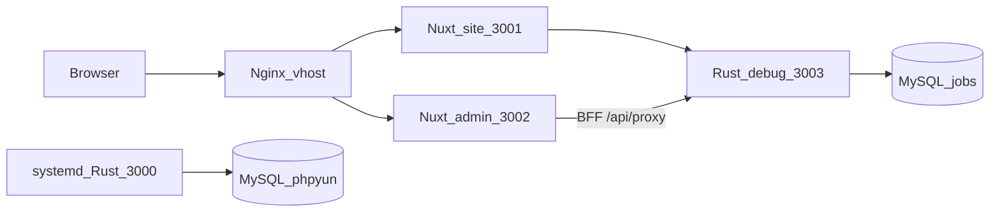

# 管理后台进度（Admin Nuxt + Rust API + 伪删除）

> 2026-08-30 · 分支 `feat/frontend-backend-split`  
> 总方案：[FRONTEND_BACKEND_SPLIT.md](./FRONTEND_BACKEND_SPLIT.md)（T0–T14 勾选偏旧，细进度以本文为准）  
> UI 约定：[ADMIN_PHP_TO_NUXT.md](./ADMIN_PHP_TO_NUXT.md)  
> Cursor plan 原文：[`.cursor/plans/admin_现状盘点.plan.md`](../.cursor/plans/admin_现状盘点.plan.md)、[`.cursor/plans/admin_下一批迁移.plan.md`](../.cursor/plans/admin_下一批迁移.plan.md)  
> 实施稿：[plans/2026-08-30-admin-status.md](./plans/2026-08-30-admin-status.md)、[plans/2026-08-30-admin-gongzhao-ads-finance.md](./plans/2026-08-30-admin-gongzhao-ads-finance.md)

## 文档落盘

| 文件 | 用途 |
|---|---|
| `.cursor/plans/*.plan.md` | Cursor plan 原文，**进 git** |
| `doc/ADMIN_PROGRESS.md` | 本文：后台做到哪、伪删除范围、下一项 |
| `doc/plans/YYYY-MM-DD-短名.md` | 每次实施 plan 的可读稿 |

每次 plan：**仓库 `.cursor/plans/` + `doc/plans/`** 都要有；现状更新本文。不要 ignore `.cursor/`。

## 运行时

两份 `phpyun-rs`、共 4 个监听口（每进程：HTTP + metrics）。`.env` 默认 `BIND=127.0.0.1:3000`、`METRICS_BIND=127.0.0.1:9090`；本仓库 debug 用环境变量改绑。

| 进程 | HTTP | Metrics | 二进制 | 库 | 谁在用 |
|---|---|---|---|---|---|
| systemd `test-jobs-phpyun-rs` | **`:3000`** | **`:9090`** | `/opt/phpyun-rs/phpyun-rs` | 原库 phpyun | 旧栈。**禁止 kill/重启/替换** |
| 本仓库 debug | **`:3003`** | **`:9091`** | `phpyun-rs/target/debug/phpyun-rs` | **jobs** | Admin/Site `RUST_API_URL` |

Nuxt（不是 Rust）：`:3001` site、`:3002` admin。

调用链：Vue `httpPost('m=&c=&a=')` → `web/apps/admin/app/utils/phpMap.ts` → BFF `/api/proxy` → **`:3003`** `POST /v1/admin/*`。没有万能 invoke。业务只写 **jobs**，不写 **phpyun**。

## Admin Nuxt

- `web/apps/admin/app/pages/`：**121** 个 path 页，对齐 PHP `router.js`。
- UI：`web/apps/admin/app/admin-php/`（PHP Vue 语法迁入）。
- `phpMap`：具名 `m/c/a` + `MODULE_ROUTES` 的 list/save/del/status。具名 action **禁止**静默落到 list（`904fff4b`）。招聘会/新闻/问答/专题走 `phpContent` → `POST /v1/admin/php-content/{module}/{action}`。
- 刻意不做：校园/猎头/培训/spview、`database`/`generate_*`/`admin_uc`。

## Rust 后台 API

- Crate：`phpyun-rs/crates/products/recruit/api-admin`（约 49 个 `v1/*.rs`，含 `php_content.rs`）。
- OpenAPI 快照仍锁 **297** 条（`doc/snapshots/admin_paths.txt`）。PHP 同构 `php-*`（含 `php-content`）**不进 AdminDoc**，避免改快照。
- 已按 PHP 补：企业校验/开户/编辑/Imitate/套餐/comcert、职位 add、简历/会员 add-edit-save、SEO/注册设置/短信/海报形状、公告 add GET 表单、**招聘会/新闻/问答/专题具名 action**。

入口：`POST /v1/admin/php-content/{module}/{action}`（axum `{param}`），service `admin_php_content_service::dispatch`。SQL 在 repo。

| module | 已接 action |
|---|---|
| `fairs` | index, get-group, add, delete, com, status, audit, getjoblist, upjob, comadd, getcomlist, getzhanwei, upzhanwei, comaddsave, delcom, ajaxsort, upisopen, checksitedid |
| `news` | index, addnews, delete, group, addgroup, delgroup, ajax, recommend, changeClass, checksitedid, savepro, type, property, delpro |
| `question` | getGroup, index, add, save, delete, recommend, getanswer, statusAnswer, save_answer, delanswer, getcomment, statusAnswerReview, save_review, delreview, config, configSave |
| `special` | index, add, delete, setOrder, recommend, ajaxsort, setFamous, addlist, set_comaddsearch, audit, comjob |

专题企业 `com`/`statuscom`/`delcom` 仍走原 `/v1/admin/specials/companies*`。招聘会/专题**主表**不在伪删除白名单，del 是物理 DELETE；新闻/问答走 `deleted=1`。

## 伪删除

提交 `9e129225`：

1. 二次校验：路径以 `/delete`、`/purge` 结尾时，再查 `phpyun_admin_user` 是否有效（`php-content/*/delete` 也会打到）。
2. 白名单约 39 张表 `deleted=1`；列表 `COALESCE(deleted,0)=0`。
3. 迁移 `phpyun-rs/migrations/sqlx/20260829000001_admin_soft_delete.sql`。

仍用物理 DELETE 或业务状态位：职位 `state=2`、会员/企业注销、KV/银行卡/海报模板、日志/回收站 purge、**招聘会主表 `phpyun_zhaopinhui`、专题主表 `phpyun_special`（未进白名单）**。

回收站 `/v1/admin/recycle-bin` 仍是 PHP recycle 表，不是 `deleted` 列还原器。

## 按 PHP 补接口

| 块 | 状态 |
|---|---|
| 企业/职位/简历会员写 | 完成 |
| SEO / 注册设置 / 短信 / 海报 / 公告 add GET | 完成（`bc694820`） |
| 招聘会 / 新闻 / 问答 / 专题具名 action | **完成**（`php-content`，不进 AdminDoc） |
| 前台 OAuth 回调 + 支付真单 | **回调已接、支付宝跳转已接、沙箱真单未验收** |
| 公招 / 公告剩余 / 广告 / 财务 | **进行中**（本波） |
| 招聘会/专题主表伪删除 | **进行中**（本波） |

### 前台 OAuth / 支付（本轮）

- 登录页 `?code&state` → BFF `POST /api/auth/oauth-login` → Rust `/v1/wap/oauth/{wechat,qq,weibo}/code-login`，写 cookie。点击 OAuth 前把 provider 放进 `sessionStorage`。
- 会员下单 `POST /v1/mcenter/vip/orders`：`channel=alipay` 时先校验配置再插待支付单，返回 `pay_url`（legacy `create_direct_pay_by_user`，notify `{web_base_url}/callback/alipay`）。`/user/pay` 有 `pay_url` 则跳转，不再自动 mock-paid。
- 未做：微信 unifiedorder；沙箱真实付款未跑通。支付 notify handler 原本就在。

## 下一项（本波之后）

微聘 once/tiny 定价档、兼职 show/audit、名企 `a=save` 接到已有 `/hotjobs`、简历 skill/project/other、单页 `singlepage` 错映到新闻、系统分类 ajax、微信菜单 savenav、招聘会 xls/图。

## 仍弱或故意不做

- RBAC 不解析 `group_power`；导出是 CSV 不是 OLE xls
- 微信自定义菜单能力仍薄
- 支付：**支付宝页跳已接，沙箱真单未验收**；微信收款未接
- php-fpm 未卸，`uploads/` 未删
- jobs 库公告测试行 `id=2` 已 `deleted=1`（列表不可见）
- 新闻分组树拼法较糙；Alipay 缺密钥时下单会 422（不再留下无 URL 的待支付单）
