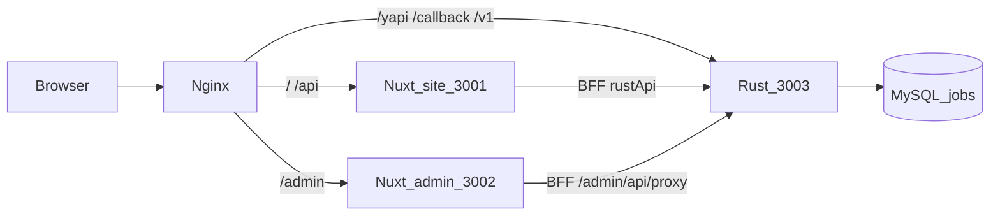

# 招聘系统架构（现状）

> 2026-08-31 · 分支 `feat/frontend-backend-split`  
> 对照仓库实况，不是改造方案。方案原文见 [FRONTEND_BACKEND_SPLIT.md](./FRONTEND_BACKEND_SPLIT.md)（文内「没有 main.rs / 没有 package.json / admin 72 条」等已作废）。

PHP 页面已切走。现在跑的是：

- **前台 / 会员中心**：Nuxt 4（`web/apps/site`）
- **管理后台**：Nuxt 4 SPA（`web/apps/admin`，`ssr: false`）
- **API**：Rust axum（`phpyun-rs`），同一进程挂 App 接口 + 后台接口
- **Flutter App**：继续用 `/v1/wap`、`/v1/mcenter`（契约只加法）
- **`uploads/`**：PHP 源码与静态资源，**只读对照**，不改业务

## 完成面一览（路径 / 端口 / URL）

Rust 的 **App API 与 Admin API 是同一个 binary、同一组端口**，只是 crate 和 URL 前缀不同。Nuxt 前台 / 后台是两个 Node。Flutter 不在本仓库，吃 App API。

### Nuxt 前台（PC + H5 同一套，`@phpyun/site`）

PC / H5 不是两套应用：同一 Nuxt，CSS 用 `min-width:1200px` / `max-width:1199px` 切换。

| 项 | 现状 |
|---|---|
| 代码 | `web/apps/site/`（页面 `app/pages/`，约 **85** 个 `.vue`） |
| 公共层 | `web/layers/base/`（BFF、登录 cookie）、`web/layers/ui/` |
| 样式 / 上传静态 | `uploads/app/template/{default,wap,member}` → `/legacy/pc` `/legacy/h5` `/legacy/member`；用户文件 `/data/upload/` |
| 进程 | **`:3001`** · `web/apps/site/.output/server/index.mjs` · `RUST_API_URL=http://127.0.0.1:3003` |
| 公网页面 | `https://job1.ov6.com/`（systemd `NUXT_PUBLIC_SITE_URL`）；切站样例 `https://test-jobs.ov6.com/` |
| 本机 | `http://127.0.0.1:3001/` |
| 浏览器 URL | `/` `/jobs` `/jobs/:id` `/companies` `/login` `/register`；求职者 `/user/**`、企业 `/com/**`（这两段 `ssr: false`） |
| 调 API | 浏览器 → **`/api/proxy/v1/wap/...`**、**`/api/proxy/v1/mcenter/...`** → Rust **`:3003`** |
| 登录 BFF | `web/layers/base/server/routes/api/auth/`（如 `POST /api/auth/login`） |

### Nuxt 管理后台（`@phpyun/admin`）

| 项 | 现状 |
|---|---|
| 代码 | `web/apps/admin/`；页面 `app/pages/*.vue`（**121** 个，对齐 PHP `router.js`） |
| UI / 映射 | `app/admin-php/`；`app/utils/phpMap.ts`；静态 `public/php-admin/` |
| 进程 | **`:3002`** · `web/apps/admin/.output/server/index.mjs` · `ssr: false` · `baseURL=/admin/` |
| 公网页面 | `https://job2.ov6.com/admin/`；切站样例 `https://test-jobs.ov6.com/admin/` |
| 本机 | 直连 `http://127.0.0.1:3002/admin/`（经 nginx 则主机名 + `/admin/`） |
| 浏览器 URL | `/admin/login`、`/admin/index`，以及 121 个 PHP path（如 `/admin/companyjob`、`/admin/resume`） |
| 调 API | 浏览器 → **`/admin/api/proxy/v1/admin/...`** → Rust **`:3003`** |
| 登录 | `POST /admin/api/auth/admin-login` → Rust `POST /v1/admin/login` |

### Rust App API（给 Flutter + Nuxt 前台）

| 项 | 现状 |
|---|---|
| 代码 | `phpyun-rs/crates/products/recruit/api/`（包名 `phpyun-handlers`） |
| 入口 | `phpyun-rs/crates/apps/server/`（唯一 `main.rs`，binary `phpyun-rs`） |
| 业务 / 平台 | `.../services/`、`.../models/`；`crates/platform/{core,auth}` |
| 契约快照 | `doc/snapshots/v1_paths.txt`（**405** 条） |
| 进程 | systemd `test-jobs-phpyun-rs-3003` **`:3003`**（metrics `:9091`），库 **jobs**。旧 `:3000` 已停用。 |
| 本机 URL | `http://127.0.0.1:3003/v1/wap/*`、`/v1/mcenter/*`、`/v2/wap/*`、`/callback/*`、`/health` |
| OpenAPI | `http://127.0.0.1:3003/api-docs/v1/openapi.json`（Swagger `/docs/`） |
| 公网 Flutter | nginx **`/yapi/`** 剥前缀后打 **`:3003`**，如 `https://test-jobs.ov6.com/yapi/v1/wap/...` |
| 支付回调 | 公网 **`/callback/`** → **`:3003`**（库 **jobs**） |

### Rust Admin API（只给 Nuxt admin）

| 项 | 现状 |
|---|---|
| 代码 | `phpyun-rs/crates/products/recruit/api-admin/`（包名 `phpyun-api-admin`） |
| 挂载 | 与 App API **同一进程、同一端口**，`assemble` 时 merge admin router |
| 具名路径 | `doc/snapshots/admin_paths.txt`（**297** 条），如 `/v1/admin/login` `/v1/admin/menu` `/v1/admin/jobs` |
| PHP 长尾 | `POST /v1/admin/php-content/{module}/{action}`（**不进** OpenAPI；实现 `services/src/admin_php_content_service.rs`） |
| 本机 URL | `http://127.0.0.1:3003/v1/admin/...` |
| OpenAPI | `http://127.0.0.1:3003/api-docs/admin/openapi.json` |
| 谁打它 | 经 Admin BFF 或 `/yapi/v1/admin/...` 都打 **`:3003`**。 |

---

---

## 1. 运行拓扑

本机 **一份** Rust（`:3003`）+ site `:3001` + admin `:3002`。旧 systemd `:3000` 已 disable。

| 进程 | HTTP | Metrics | 二进制 | MySQL | 谁在用 |
|---|---|---|---|---|---|
| systemd `test-jobs-phpyun-rs-3003` | **`:3003`** | **`:9091`** | `phpyun-rs/target/debug/phpyun-rs` | 库 **jobs** | Site / Admin / `/yapi/` / `/callback/` |
| Nuxt site | **`:3001`** | — | `web/apps/site/.output/server/index.mjs` | 经 `:3003` | 公网页 |
| Nuxt admin | **`:3002`** | — | `web/apps/admin/.output/server/index.mjs` | 经 `:3003` | `/admin/` |

仓库里的切站样例是 `ops/nginx/zzzz.com.nuxt-cutover.conf`（`server_name test-jobs.ov6.com`）。job1 / job2 等 vhost 同一套三口：

| location | 上游 |
|---|---|
| `/` | `:3001` site |
| `/admin/` | `:3002` admin |
| `/api/` | `:3001`（Site BFF，再转发 Rust） |
| `/data/upload/` | `uploads/data/upload/` 静态 |
| `/yapi/` `/v1/` `/v2/` `/health` `/ready` | **`:3003`** |
| `/callback/` | **`:3003`** 支付/采集回调 |



site 的 systemd 里 `NUXT_PUBLIC_SITE_URL=https://job1.ov6.com`。改代码只写 **jobs** 库，不要写 **phpyun**。不要再启动 `:3000`。

### 本仓库 Rust 怎么起

```bash
cd /www/wwwroot/zzzz.com/phpyun-rs
TMPDIR=/var/tmp/cargo-tmp CARGO_TARGET_DIR=/www/wwwroot/zzzz.com/phpyun-rs/target \
  cargo build -p phpyun-rs --offline -j 1
sudo systemctl restart test-jobs-phpyun-rs-3003
```

Admin 重建后只重启 `:3002`：

```bash
PATH=/var/tmp/node-dist/node-v22.22.1-linux-arm64/bin:$PATH
ADMIN_ASSET_TAG=$(git rev-parse --short HEAD) pnpm --filter @phpyun/admin build
# kill 仅 cwd=web/apps/admin 且监听 3002 的 node，再：
RUST_API_URL=http://127.0.0.1:3003 NUXT_RUST_API=http://127.0.0.1:3003 \
  HOST=127.0.0.1 PORT=3002 node web/apps/admin/.output/server/index.mjs
```

开发 token：`:3003` 的 `GET /dev/token`（仅 debug 环境）。

---

## 2. 仓库目录

```
zzzz.com/
├─ phpyun-rs/                 Rust workspace
│  ├─ crates/platform/core    配置、JWT、DB/Redis、中间件、信封
│  ├─ crates/platform/auth
│  ├─ crates/products/recruit/models      sqlx，按表分组
│  ├─ crates/products/recruit/services    业务
│  ├─ crates/products/recruit/api         App：/v1/wap /v1/mcenter /v2 /callback
│  ├─ crates/products/recruit/api-admin   后台：/v1/admin
│  └─ crates/apps/server                  唯一 binary：phpyun-rs
├─ web/                       pnpm monorepo（Nuxt 4.5.2）
│  ├─ apps/site               前台 + 会员
│  ├─ apps/admin              后台 SPA，baseURL=/admin/
│  └─ layers/base + layers/ui BFF 代理、登录 cookie、公共组件
├─ uploads/                   PHPYun 源码与模板（只读规格 + 静态）
├─ doc/                       本文档
└─ ops/                       nginx / systemd 草稿
```

表前缀 `phpyun_`，schema 不改。Handler **禁止**直接 sqlx/redis/reqwest；SQL 放 models repo。

---

## 3. 后端

### 3.1 装配

`apps/server` 加载配置 → `AppState`（MySQL / Redis / 存储）→ 可选 sqlx migrate → 进程内 cron → `assemble`：

- `/v1/wap`、`/v1/mcenter`、`/v2`、`/callback` 来自 `phpyun-handlers`
- `/v1/admin` 来自 `phpyun-api-admin`（crate 内挂 `admin_guard` + 删除二次校验）
- `/health` `/ready` `/robots.txt` `/dev/token` 在中间件外

OpenAPI：

- App：`/api-docs/v1/openapi.json`（快照 `doc/snapshots/v1_paths.txt`，**405** 条）
- 后台：`/api-docs/admin/openapi.json`（快照 `doc/snapshots/admin_paths.txt`，**297** 条）
- **`POST /v1/admin/php-content/{module}/{action}` 不进 AdminDoc**，避免每接一个 PHP action 就改快照。

`api` 与 `api-admin` 平级，互不依赖，都只调 `services`。

### 3.2 信封与鉴权

Rust 统一：

```json
{ "code": 200, "key": "ok", "msg": "ok", "data": { } }
```

JWT `usertype`：`1` 求职者、`2` 企业、`3` 后台。Cookie 由 Nuxt BFF 写成 httpOnly，再以 `Authorization: Bearer` 转给 Rust。

分页：query 上的 `page` / `page_size`。后台列表给 PHP Vue 时，还要有 `perPage`、`pageSizes`（`AdminPaged` 或 php-content 的 `paged()`）。Vue 常把筛选项做成 **字符串**（`"1"`、`""`）；`Option<i32>` 必须用宽松反序列化，否则 HTTP 400。

### 3.3 后台两条腿

不要做成 `POST /v1/admin/invoke`。PHP 页仍写 `httpPost('m=&c=&a=')`，在 **前端** 翻成显式路径。

1. **具名 `/v1/admin/...`**  
   进 OpenAPI 快照。例：`/v1/admin/jobs`、`/v1/admin/login`、`/v1/admin/menu`。

2. **`POST /v1/admin/php-content/{module}/{action}`**  
   slug：字母数字、`-`、`_`。`dispatch` 按 `(module, action)` 分发。用来接 PHP 长尾，不膨胀 AdminDoc。

`php-content` 已有模块（以 `dispatch` 为准，会继续加）：  
`fairs` `news` `gongzhao` `announce` `ads` `ad-class` `finance-*` `question` `special` `once` `tiny` `part` `hotjob` `resume` `interview` `comlog` `pages` `job-class` `wx-nav` `cat-class` `user-gap` `keyword` `web-config` `email-set`。

未知 `(module, action)` → `unknown_php_action`。

### 3.4 App 契约

`/v1/wap` + `/v1/mcenter` **只加法**：可加可选字段/参数/端点；禁止改名、改类型、删字段、改语义。破坏性变更走 `/v2`（目前主要是 login 时间字段形状）。Web 前台复用这套，不另起 `/v1/web`。

---

## 4. 前端

### 4.1 BFF

`web/layers/base`：

- `server/routes/api/proxy/[...path].ts` — 把 cookie 换成 Bearer，转发 `runtimeConfig.rustApi`（默认 `http://127.0.0.1:3003`）
- `server/routes/api/auth/*` — 前台登录 / 后台登录 / refresh / me / OAuth
- `runtimeConfig.rustApi` 默认 `http://127.0.0.1:3003`

Admin 的 `app.baseURL` 是 `/admin/`，所以浏览器打的是 `/admin/api/proxy/v1/admin/...`。

### 4.2 前台 `apps/site`

- 约 **85** 个 `pages/*.vue`：公开列表/详情 + `/user/*` 求职者 + `/com/*` 企业
- `/user/**`、`/com/**` `ssr: false`
- 样式大量从 `uploads/app/template/{default,wap,member}` 以 `legacy/` 挂出
- 调用 `/v1/wap`、`/v1/mcenter`（经 BFF）

### 4.3 后台 `apps/admin`

- **121** 个 `app/pages/*.vue`，path 对齐 PHP `uploads/app/template/admin/js/router.js`（一 path 一页）
- UI 在 `app/admin-php/`，从 PHP Vue 做语法迁入（Element Plus），不自造 `/jobs` 当主界面
- `httpPost('m=&c=&a=')` → [`phpMap.ts`](../web/apps/admin/app/utils/phpMap.ts) `resolvePhpAction`：
  - 非 index：先精确 `PHP_ADMIN_MAP[m/c/a]`，再 `MODULE_ROUTES` 的 `del`/`delete`/`save`/`add`/`status`/`audit`/`checkstate`
  - index：先精确再 MODULE `list`
- 未映射返回 `{ error: 1, msg: "未映射的后台接口: …" }`（HTTP 仍可能 200）。列表若只在 `error==0` 时关 loading，会一直转圈。
- 静态：`public/php-admin/`；构建资源 `/_n/<ADMIN_ASSET_TAG>/`，HTML `no-store`
- 映射条数会变，**不要写进架构**。以 `phpMap.ts` 为准。

成功时 `httpPost` 把 Rust 信封翻成 PHP 形：`{ error: 0, msg, data }`。`rawBody` 的接口（如部分 `*Num`）整包当 `data`。

---

## 5. 数据与删除

- **schema 不动**：表名仍是 `phpyun_*`，不改结构。8/30 起业务库换成独立库名 **`jobs`**（commit `852b7792`），不是继续写原库 `phpyun`。
- **Site / Admin / `/yapi/` / `/callback/`（`:3003`）连 `jobs`**。`phpyun-rs/.env` 与 `.env.pro` 都是这个库。`.env.dev` 是测试库 `phpyun_test`。
- 原库 **`phpyun`** 不再给 Rust 进程。不要再启动旧 `:3000`。
- 后台一批表用 `deleted=1` 伪删除，列表加 `COALESCE(deleted,0)=0`。白名单在 models `soft_delete`。
- 仍物理删或改业务状态的：职位下架 `state`、会员注销、日志 purge、财务订单（按 PHP）等。
- 回收站 `/v1/admin/recycle-bin` 是 PHP recycle 表，不是通用 `deleted` 还原器。
- 无源码、本盘不做：猎头、spview、完整校园/培训后台。

---

## 6. 硬约束

1. **不要再启动旧 `:3000`**（`test-jobs-phpyun-rs` 已 disable）。API 只走 `test-jobs-phpyun-rs-3003`。
2. **不要改 `uploads/`**（含 PHP 控制器和后台模板）。
3. **不要**给 Admin 做万能 `invoke`。
4. **不要**把 php-content 写进 AdminDoc 快照。
5. App `/v1/wap` `/v1/mcenter` 只加法。
6. Site/Admin 的 `RUST_API_URL` 必须是 **`:3003`**。
7. 禁止 `git push --force`；有实质改动按仓库规则中文 commit 并 push。

---

## 7. 刻意不做 / 仍弱

- 卸 php-fpm、删除 `uploads/`
- `database` / `generate_*` / `admin_uc` 类破坏性运维页
- 图片上传栈（多处返回 `upload_not_supported`）
- 汉字转拼音（`ajaxpinyin` 现直接成功）
- RBAC 不解析 `group_power`；导出是 CSV 不是 OLE xls
- 微信收款 unifiedorder；支付宝沙箱真单未当验收项
- 旧伪静态 URL、论坛 UC 互通

后台「页齐、接口未齐」：121 个 path 骨架在，缺的是某个 `m/c/a` 有没有打到正确 Rust（错表、未映射、或 `Option<i32>` 吃不下 Vue 字符串）。补的时候对照 **PHP 控制器**，改 phpMap + api-admin/php-content + repo，不要先写一份会过期的名单当架构。

---

## 8. 文档与快照

| 该看 | 不该当现状 |
|---|---|
| 本文 | `doc/plans/*.md` 某日提纲 |
| `ADMIN_PHP_TO_NUXT.md` 约定 | `FRONTEND_BACKEND_SPLIT.md` 里的「当前数字」 |
| `phpMap.ts`、`dispatch` 源码 | `ADMIN_PROGRESS.md` / `API_GAP.md` 里的条数 |

改了进 OpenAPI 的路由，才更新 `doc/snapshots/` 并跑：

```bash
cargo test -p phpyun-handlers --test openapi_snapshot
cargo test -p phpyun-rs --test openapi_contract
```
