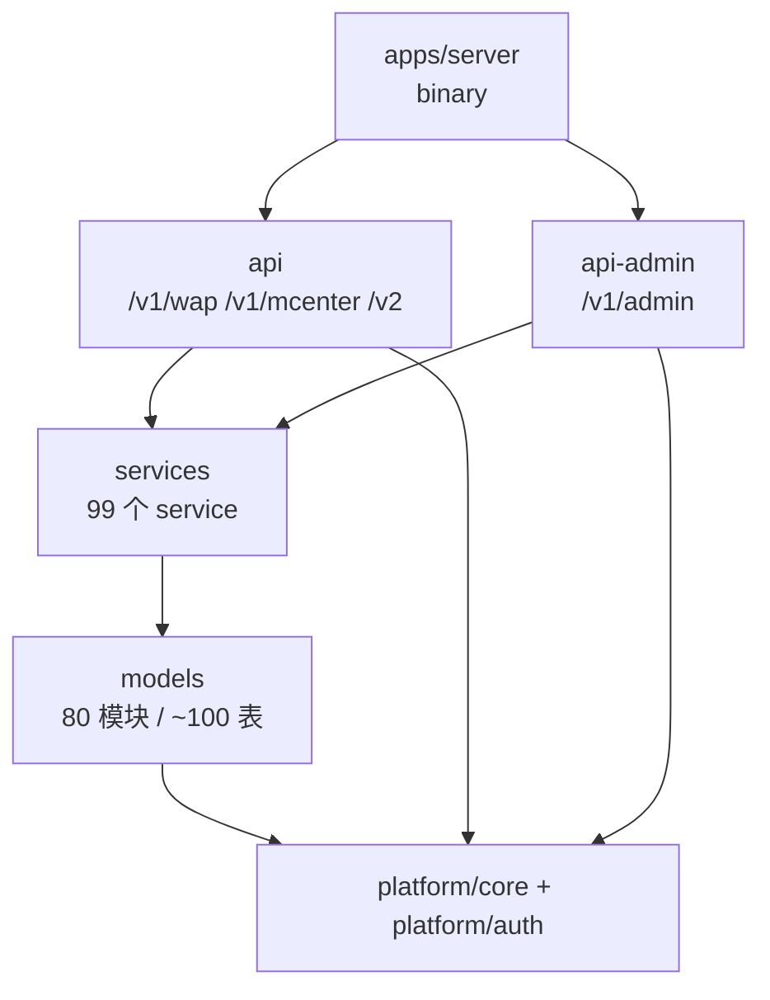
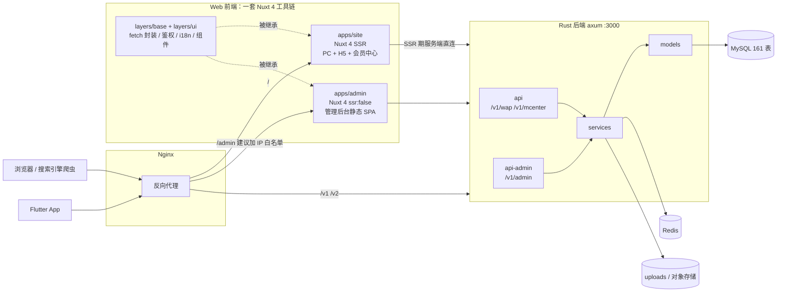

# 前后端分离改造方案：PHP 全量退役，Rust + Nuxt 4 接管

> 文档版本 v2.0 · 2026-08-25
> 状态：执行中（进度以文末「进度追踪」为准，未勾选表示未按验收通过）
> 分支：`feat/frontend-backend-split`
>
> v1.1：前端框架由 Nuxt 3 改为 **Nuxt 4.5.2**（Nuxt 3 已于 2026-07-31 EOL）
> v1.2：管理后台改为同样用 Nuxt 4（`ssr: false`），前端合并为一个 pnpm monorepo
> v2.0：明确现有 Rust API 是 **Flutter App 的既有契约、不可破坏**；新增后端 crate 拆分设计（`api-admin`）与接口完整性/唯一性的保障机制

## 如何使用本文档

下面的任务按 `T0` 到 `T14` 编号，每块都是**可独立执行的单元**，包含目标、前置条件、步骤、验收标准和建议的 commit 信息。

批量执行时直接指定编号，例如「执行 doc/FRONTEND_BACKEND_SPLIT.md 的 T1 和 T2」。任务之间的依赖写在「前置」里，没有前置依赖的可以并行。

每完成一个任务，回到文末的「进度追踪」把对应条目勾上。

---

## 1. 背景与边界

### 现状

- **`phpyun-rs` 已有 481 条 axum 路由**：`/v1/wap` 177 条、`/v1/mcenter` 227 条、`/v1/admin` 72 条、`/v2` 1 条、运维 4 条。配套 99 个 service、80 个 model、640 多处 sqlx 查询，477 个接口带 utoipa OpenAPI 注解。
- **但它现在跑不起来**。`phpyun-rs/Cargo.toml` 第 3-4 行写着 "Server binaries ... intentionally out of scope"，全仓库没有任何 `main.rs`，五个 member 全是 library crate。
- **Web 前端零起点**。整个仓库没有 `package.json`。PHP 侧是 479 个 Smarty 模板做服务端渲染（default 100 / wap 209 / member 123），后台是 Vue 2.7 + Element UI + httpVueLoader 浏览器直接加载 219 个 `.vue`，没有任何构建链。
- **数据库不动**。161 张表、`phpyun_` 前缀，schema 全程保持不变。

### 边界：什么不在本次范围内

- **Flutter App 已完成约 90%，本次不碰**。但它是现有 Rust API 的主要消费方，这构成一条硬约束，见下。
- **MySQL schema 不改**。

### 已确认的前提

- 前端用 **Nuxt 4.5.2**（Vue 3），一套响应式代码覆盖 PC 与 H5
- **全量重做**，包括管理后台，最终彻底删除 PHP
- **用新 URL**，不保留 `/job/list/1-2-3-4-5-6-7-8.html` 这类旧伪静态格式，不做 301
- 当前是 dev 环境**无真实用户**（指 Web 侧），不需要灰度过渡
- **Web 前台纯复用现有 App 接口**，不另起一套 `/v1/web`
- **`/v1/admin` 的 72 个接口迁出到新的 `api-admin` crate**，URL 保持不变

---

## 2. 后端设计

### 2.1 最重要的约束：App 契约冻结

现有 `/v1/wap` 和 `/v1/mcenter` 共 404 个接口是 **Flutter App 正在使用的线上契约**。Web 前台复用它们，因此这些接口会同时服务两个客户端。

**对这两个命名空间只允许做加法：**

- 允许：新增 endpoint；给响应加**可选**字段；给请求加**可选**参数；给现有 POST 挂一个 GET 别名
- 禁止：改字段名、改字段类型、删字段、改字段语义、把可选改成必填、改状态码或 `key` 取值

**如果 Web 确实需要不兼容的形状，走 `/v2`。** 这套机制已经存在且正是为此设计的，见 `crates/products/recruit/api/src/routes.rs:3-6`：v2 只覆盖有破坏性变更的端点，其余自动 merge v1。目前 v2 下只有一个 `login`，说明这条路走得通。

这条约束不能靠自觉，要靠测试守住，见 2.5。

### 2.2 crate 拆分

沿用现有的 `platform/` 与 `products/recruit/` 两级布局，新增一个平级的 api crate：

```
crates/
├─ platform/
│  ├─ core/            phpyun-core        不动
│  └─ auth/            phpyun-auth        不动
├─ products/recruit/
│  ├─ models/          phpyun-models      不动
│  ├─ services/        phpyun-services    共享，按缺口扩充
│  ├─ api/             phpyun-handlers    App + Web：/v1/wap、/v1/mcenter、/v2
│  └─ api-admin/       phpyun-api-admin   新增：/v1/admin
└─ apps/
   └─ server/          phpyun-server      T1 新增：唯一 binary
```

依赖严格单向，两个 api crate **平级且互不依赖**：



拆开的收益有四点：

1. **编译隔离**。后台要补上百个接口，改 admin 不必重编 App 的 handlers。
2. **依赖隔离**。后台专用的东西（Excel 导出、报表聚合）只进 `api-admin`，不污染面向公网的 crate。
3. **安全内聚**。见 2.3。
4. **文档分流**。见 2.4。

### 2.3 admin guard 收进 crate 内部

现在 admin 的角色校验挂在 `routes.rs:74-79` 的 `build_router_with_state` 里。这留了个坑：同一个 crate 还导出了 `build_router`，调用方一旦用错，`/v1/admin/*` 就完全裸奔。注释里也承认了这点，只能靠"生产调用方请优先用后者"的口头约定。

迁移后由 `api-admin` 自己在 `router()` 内部挂 guard，调用方拿不到未受保护的版本。这是把一个运行时约定变成类型层面的保证，属于拆分顺带拿到的安全收益。

每个 api crate 对外只暴露一组固定契约，便于 server 统一装配、也便于写检查：

```rust
pub fn router(state: AppState) -> Router<AppState>;
pub fn openapi() -> utoipa::openapi::OpenApi;
pub fn get_allowed_paths() -> Vec<&'static str>;
```

### 2.4 OpenAPI 拆成两份

现在 `openapi.rs` 是 1182 行的巨型 `V1Doc`，把 481 条路径全列在一处。拆分后各 crate 维护自己的文档，对外暴露两个 spec：

- `/api-docs/v1/openapi.json` — App + Web 共用（`/v1/wap`、`/v1/mcenter`）
- `/api-docs/admin/openapi.json` — 管理后台（`/v1/admin`）

这样分不只是为了整洁：前端 `apps/site` 和 `apps/admin` 各取各的 spec 生成 TS 类型，两边的类型文件都小一半；Flutter 那边也不需要在 400 多个接口里翻找后台接口。`/v2` 继续单独一份。

Swagger UI 的多 URL 下拉已经支持，见 `openapi.rs:1164-1167`，加一行 `.url(...)` 即可。

### 2.5 完整性与唯一性怎么保证

这两条是明确要求，所以要落成 CI 里跑得动的检查，而不是文档里的口号。

**唯一性**

| 维度 | 保障手段 |
|---|---|
| 业务逻辑唯一 | 逻辑只存在于 `services`。`api-admin` 照抄 `api/src/lib.rs:16-21` 的禁令：handler 里不得出现 `sqlx` / `redis` / `moka` / `reqwest`。用 clippy 的 `disallowed_types` 强制，而非靠 review |
| 同一能力不写两遍 | 后台列职位和 App 列职位响应形状不同，但**必须调同一个 `job_service`**，不得各写一份 SQL |
| 路由唯一 | 集成测试：合并两个 router 后断言不存在重复的 `(method, path)` |
| operationId 唯一 | `openapi.rs` 已有 `UniqueOperationId` modifier，拆成两份文档后需扩展为跨文档校验 |

**完整性**

| 维度 | 保障手段 |
|---|---|
| 每条路由都有文档 | 现在 481 条里 477 条有 `#[utoipa::path]`，缺 4 条。加测试：遍历 router 路由表与 OpenAPI paths 取差集，非空即失败 |
| 后台功能不缺项 | 以 T4 的缺口表为准逐项对齐，缺口表本身进版本库 |
| 后台写操作可追溯 | `/v1/admin` 的每个写接口都要落审计日志，core 已有 `audit.rs` |
| App 契约不被破坏 | T3 迁移前后对 `/v1/wap` + `/v1/mcenter` 的路由表和 OpenAPI 做快照比对，见 2.1 |

---

## 3. 前端设计

### 3.1 技术栈全景

总原则是**尽量减少语种和工具链数量**，一类端只用一套。

- **后端**：Rust 一门语言全包，含 Web API、定时任务、支付回调、文件处理
- **Web 前端**：TypeScript + Vue 3，统一由 **Nuxt 4.5.2** 承载。PC 与 H5 走 SSR，管理后台走 `ssr: false` 的 SPA，**同框架、同工具链、同套约定**
- **移动 App**：Dart + Flutter（已完成约 90%，本次不动）

三类客户端的接口代码都从 OpenAPI 规范生成，不手写：Web 用 `openapi-typescript`，Flutter 用 `openapi-generator` 的 `dart-dio`。后端改接口，客户端编译期就报错。

### 3.2 整体架构



### 3.3 目录结构

```
zzzz.com/
├─ doc/                       # 本文档
├─ phpyun-rs/                 # Rust 后端，crate 布局见 2.2
├─ web/                       # T6 新增：pnpm workspace，Web 前端全在这里
│  ├─ layers/
│  │  ├─ base/                # fetch 封装、鉴权、错误处理、i18n
│  │  └─ ui/                  # 两端共用的基础组件
│  └─ apps/
│     ├─ site/                # PC + H5 + 会员中心，SSR
│     │  └─ app/              # Nuxt 4 默认 srcDir
│     └─ admin/               # 管理后台，ssr: false 纯静态
│        └─ app/
└─ uploads/                   # PHP，T14 后删除（保留 data/upload/ 用户文件）
```

两个 app 用 Nuxt Layers 的 `extends` 继承共享层，组件、composable、工具函数自动可用，不用手写 import 路径。

注意生成的 API 类型**不放共享层**：`apps/site` 消费 `/api-docs/v1/openapi.json`，`apps/admin` 消费 `/api-docs/admin/openapi.json`，各自生成、各自持有。`layers/base` 只放与具体接口无关的东西——fetch 封装、响应契约解包、token 刷新、错误分支。

---

## 4. 分支策略

当前在 `dev` 分支（`cc83f65`），仓库另有 `main`。本次改造跨度 4-5 个月、会新增前端工程并最终删除 `uploads/`，不适合直接在 `dev` 上做。

- 从 `dev` 切出长期特性分支 **`feat/frontend-backend-split`**，后续所有改动只提交到这里，`dev` 保持随时可回退。
- 按 `.cursor/rules/git-safety.mdc`，每完成一小块就用中文 commit message 提交；**不主动 `git push`**。
- 阶段性成果（T1 的 binary、T3 的 crate 拆分、T6 的前端骨架）验收通过后单独合回 `dev`，避免分支漂移四五个月导致最后一次合并冲突爆炸。
- 本地 `dev`（`cc83f65`）与 `origin/dev`（`fa75e9a`）已不同步，切分支前先确认这个差异是预期的。

---

## 5. 任务清单

### T0 修复终端环境

**目标**：让 Shell 能正常执行命令。

**前置**：无。**这是所有任务的前提**。

**背景**：制定本方案时，Shell 工具在该环境里完全卡死——`ls`、`git log`、`git branch --show-current` 三条命令都挂着不返回任何输出，超过 5 分钟零响应。文档里的 git 信息是直接读 `.git/HEAD` 和 `.git/packed-refs` 拿到的。

**步骤**：
1. 在本机终端手动执行 `git status`，确认是否同样卡住
2. 若同样卡住，排查方向：`.git` 目录锁文件、OrbStack 文件系统挂载、SSH remote 连接状态
3. 若只有 Cursor 内卡住，重连 SSH remote 或重启 cursor-server

**验收**：`ls`、`git status`、`cargo --version`、`node --version` 都能在 10 秒内返回。

---

### T1 建立 Rust binary，让后端能启动

**目标**：`phpyun-rs` 从 library-only 变成可运行的服务。

**前置**：T0

**说明**：所有零件都已存在，只是没人调用。新建 `phpyun-rs/crates/apps/server/`，写 `main.rs` 接线：

- `Config::load()`（`crates/platform/core/src/config.rs:392`）读 `.env.dev`；`.env.dev` 与 `.env.pro` 已在仓库里
- 配置里有 `WORKER_THREADS` / `THREAD_STACK_MB` / `MAX_BLOCKING_THREADS`，说明原 binary 是手搓 `tokio::runtime::Builder` 而非 `#[tokio::main]`，照此还原
- `telemetry::init(&cfg.log_level, cfg.env)` → `rayon_pool::init` → `AppState::build(config, token)`（`crates/platform/core/src/state.rs:34`）
- 路由用 `build_router_with_state`（`crates/products/recruit/api/src/routes.rs:70`），它比 `build_router` 多挂了 `/v1/admin/*` 的 admin guard，**必须用这个**（T3 拆分后这个坑会被彻底消除）
- `shutdown::wait_for_signal(token)`（`crates/platform/core/src/shutdown.rs:13`）+ `axum::serve(...).with_graceful_shutdown(...)`
- 启动时跑 sqlx migration，拉起 `scheduler::start`
- 把新 crate 加进根 `Cargo.toml` 的 `members`，并删掉第 3-4 行那句已过时的注释

**验收**：
- `cargo build` 通过，`cargo clippy -- -D warnings` 无警告
- `curl localhost:3000/health` 返回 200
- 浏览器能打开 `/docs` 的 Swagger UI（仅 dev 环境挂载）
- Ctrl-C 能优雅退出，不留僵尸连接

**提交**：`新增 crates/apps/server，恢复 phpyun-rs 可执行入口`

---

### T2 跑通冒烟测试，建立基线

**目标**：知道那 481 条从没真跑过的路由里，有多少能正确返回数据。**这份结果同时是 T3 迁移的对照基线。**

**前置**：T1

**说明**：`crates/products/recruit/api/tests/endpoint_smoke.rs:54` 会扫 OpenAPI 里全部 v1 POST 端点做冒烟，但标了 `#[ignore]`，因为需要真实 DB 和 Redis。

**步骤**：
1. 准备好 MySQL（现有 `phpyun_` 库）和 Redis，确认 `.env.dev` 连得上
2. 去掉 `#[ignore]` 或用 `cargo test -- --ignored` 跑全量
3. 记录失败清单，按模块归类
4. **导出当前完整路由表和 OpenAPI 快照存档**，供 T3 比对

**验收**：产出失败接口清单（注明原因分类：SQL 错、字段缺失、panic、鉴权等）+ 路由表快照。

**提交**：`记录 endpoint_smoke 全量冒烟结果与路由基线`

---

### T3 拆出 api-admin crate

**目标**：把 `/v1/admin` 的 72 个接口迁到独立 crate，URL 不变，**App 零影响**。设计依据见第 2 节。

**前置**：T2（需要路由基线做比对）

**步骤**：
1. 新建 `crates/products/recruit/api-admin/`，包名 `phpyun-api-admin`，加进根 `Cargo.toml` 的 `members`
2. 依赖照抄 `api/Cargo.toml`，去掉用不到的
3. `git mv` 把 `api/src/v1/admin/` 下 24 个模块整体移过去，**保留 git 历史**
4. `lib.rs` 顶部照抄 `api/src/lib.rs:9-21` 的架构规约（禁 sqlx / redis / moka / reqwest，禁业务逻辑）
5. 把 admin guard 从 `routes.rs:74-79` 移进 `api-admin::router()` 内部，见 2.3
6. 拆 `openapi.rs`：admin 相关的 paths 与 schemas 移到 `api-admin` 的 `AdminDoc`，`V1Doc` 里删干净
7. `api/src/v1/mod.rs` 去掉 `pub mod admin` 和 `.nest("/admin", ...)`；`routes.rs` 相应简化，`build_router` 与 `build_router_with_state` 的差异消失后合并为一个入口
8. `apps/server` 里 merge 两个 router，Swagger UI 加第二个 spec URL
9. admin 相关测试跟着迁到 `api-admin/tests/`

**验收**（前两条是硬性的）：
- **`/v1/wap` 与 `/v1/mcenter` 的路由表与 T2 快照逐条一致**，用测试断言而非人眼比对
- **`/v1/admin/*` 的 72 条 URL 全部不变**，未登录访问仍返回 403
- 新增测试：合并后的 router 无重复 `(method, path)`，operationId 跨两份文档唯一
- `/api-docs/v1/openapi.json` 不再包含任何 admin 路径，`/api-docs/admin/openapi.json` 恰好 72 条
- `cargo clippy -- -D warnings` 通过

**提交**：`拆出 api-admin crate，admin 接口迁出且 URL 不变`

---

### T4 接口缺口盘点

**目标**：量化「Rust 已有接口」与「PHP 现有功能」的差距。这是全量重做最大的隐藏成本，不盘完后面所有排期都是猜的。

**前置**：T1（需要 OpenAPI）

**说明**：拿 OpenAPI 的 481 条路由，对着 PHP 控制器清单逐块比对。

- **后台差距最大**：PHP 有 120 个 admin 控制器（system 38、user 32、tool 19、yunying 18、neirong 10、common 2、根目录 1），Rust 只有 72 个 admin 接口，缺口可能上百。
- **前台命名要注意**：Rust 只有 `/v1/wap` 命名空间，而 PHP 前台除 wap 外还有 `school`（校园招聘）、`spview`、`zph`（招聘会）、`train`、`lietou`、`part`、`once`、`tiny`、`redeem` 等模块，需逐个确认是否已被现有接口覆盖。Web 纯复用 App 接口，**这些缺口就是 Web 页面做不出来的地方**，必须盘清。
- **会员中心看起来还行**：PHP 88 个控制器（com 51 + user 36 + 其他）对 Rust 227 个 mcenter 接口。
- 别漏了 `uploads/api/wxapp/` 的 31 个类和 `uploads/api/locoy/` 采集接口。

**验收**：缺口表进版本库，按模块列出「PHP 有但 Rust 没有」的接口，并标注该缺口影响哪一端（Web 前台 / 会员中心 / 后台），排进 T9 / T11 / T12。

**提交**：`新增后端接口缺口盘点结果`

---

### T5 为公开读接口增加 GET 别名

**目标**：让 SSR 页面能吃到 HTTP 缓存和 CDN。

**前置**：T1。**必须在 T8 前台开写之前完成**，否则要回头改一堆调用点。

**说明**：481 条路由里几乎全是 POST，包括纯读接口。SSR 下用 POST 拉数据功能上没问题，但拿不到任何 HTTP 缓存和 CDN 收益，Nuxt 的 payload 缓存也得自己写。对招聘站这是实打实的 SEO 与成本损失。

`crates/products/recruit/api/src/routes.rs:27-32` 的 `RouteRules::allow_get_all` 已为此预留了口子，`v1/wap/wechat.rs:40` 有现成的 GET+POST 双挂载写法可参考。

**这是纯加法**：给现有 POST 路由挂一个 GET 别名，原 POST 完全不动，符合 2.1 的契约冻结规则，Flutter 侧无感知。

**范围**：职位列表/详情、企业列表/详情、简历、搜索、文章、公告等所有匿名可读接口。

**验收**：这些接口 GET 和 POST 都能通且返回一致；原有 POST 的请求响应形状零变化；冒烟测试仍绿。

**提交**：`为公开读接口增加 GET 别名以支持 SSR 缓存`

---

### T6 前端 monorepo 骨架

**目标**：建好 `web/` monorepo，含两个 Nuxt app 和两个共享 layer。

**前置**：T0

**说明**：
- pnpm workspace 管理，目录结构见 3.3
- `apps/site`：**Nuxt 4.5.2** + TypeScript + Pinia，SSR，面向公网
- `apps/admin`：**同样是 Nuxt 4.5.2**，但 `ssr: false` 跑纯 SPA，UI 用 Element Plus（选型理由见第 6 节）
- `layers/base`、`layers/ui`：两个 app 用 `extends` 继承

**版本与结构要点**：
- 用 `pnpm create nuxt@latest` 起项目，`package.json` 里把 nuxt 锁到 `^4.5.2`
- Nuxt 4 默认 `srcDir` 是 `app/`，`~` 别名指向 `app/`，即 `~/components` 解析到 `app/components/`。全新项目直接按这个结构走，**不要**用 `srcDir: '.'` 退回旧布局
- 确认 Node 版本 22.19 以上（为后续可能的 Nuxt 5 留余地）
- Layers 有个坑要提前防：默认**没有编译期约束**阻止跨 layer 乱引用。装 `eslint-plugin-nuxt-layers` 用 lint 卡住，别靠 code review
- `apps/admin` 设 `ssr: false`，构建用 `nuxt generate` 产出纯静态文件交给 Nginx，**不需要常驻 Node 进程**

**验收**：两个 app 都能 `pnpm dev` 起来并访问到一个 hello 页面；在 `layers/ui` 里放一个组件，两个 app 都能直接用而无需手写 import。

**提交**：`初始化前端 monorepo：site 与 admin 两个 Nuxt app 及共享 layers`

---

### T7 统一 API 客户端与鉴权

**目标**：一次做对，后面所有页面都省事。

**前置**：T3（需要两份 OpenAPI spec）、T6

**说明**：
- 用 `openapi-typescript` 生成类型：`apps/site` 取 `/api-docs/v1/openapi.json`，`apps/admin` 取 `/api-docs/admin/openapi.json`，各生成各的，不混在共享层
- `layers/base` 封装 `$fetch`，统一解包响应契约（见 `crates/platform/core/src/response.rs:1-30`）：`{code, key, msg, data}`，`code === 200` 取 `data`，否则按 `key` 分支（如 `session_expired` 触发重登）。`msg` 是已翻译好的文案，只用于展示、**不要 parse**
- JWT access 15 分钟 + refresh 7 天。**token 不放 localStorage**，用 Nuxt server route 做 BFF 代理，token 存 httpOnly + SameSite=Strict cookie，从根上堵死 XSS 偷 token
- 把生成类型的命令写进 `package.json` script，避免手工同步

**验收**：登录 → 拿到 token → 访问需鉴权接口 → access 过期自动 refresh → 退出登录清 cookie，整条链路通。浏览器 DevTools 里看不到任何 token 明文。

**提交**：`实现统一 API 客户端与 httpOnly cookie 鉴权`

---

### T8 公开前台页面

**目标**：替换 PHP 的 default（100 模板）和 wap（209 模板）两套，合并为一套响应式。

**前置**：T5、T7

**优先级**（按 SEO 权重排）：首页 → 职位列表 → 职位详情 → 企业列表 → 企业详情 → 简历 → 搜索 → 文章/公告 → 登录注册。列表页和详情页走 SSR。

**注意**：接口复用 App 的 `/v1/wap`。若发现某个页面需要的数据现有接口给不了，先查 T4 缺口表；确需新增接口时按 2.1 只做加法，不得改动现有形状。

**验收**：每个页面在禁用 JS 的情况下查看源码，主体内容都在 HTML 里。

**提交**：按页面分批提交，如 `实现职位列表与详情页 SSR`

---

### T9 SEO 配套

**目标**：让搜索引擎能正确抓取和展示。

**前置**：T8

**说明**：`@nuxtjs/sitemap` 自动生成站点地图；职位页加 JobPosting 结构化数据，企业页加 Organization；每页配好 title / description / canonical。

**验收**：Google 富媒体结果测试工具校验结构化数据无错误；`/sitemap.xml` 能访问且包含动态职位页。

**提交**：`增加 sitemap 与结构化数据`

---

### T10 会员中心

**目标**：替换 PHP 的 88 个 member 控制器 + 123 个模板。

**前置**：T7

**说明**：个人端 + 企业端，放在 `apps/site` 里，用 `routeRules` 对 `/user/**`、`/com/**` 关掉 SSR（不需要 SEO）。对接 227 个 `/v1/mcenter` 接口。企业端（简历库、职位管理、套餐订单）比个人端重，预留更多时间。

会员中心留在 site 而不像 admin 那样拆出去，是因为它和前台共用登录态、导航和大量业务组件，用户也会在两者间频繁跳转；admin 则是完全独立的使用场景。

**验收**：个人端完整走通「注册 → 填简历 → 投递 → 查看投递状态」；企业端走通「发职位 → 搜简历 → 邀面试 → 下单购套餐」。

**提交**：按模块分批提交。

---

### T11 管理后台

**目标**：替换 PHP 的 120 个 admin 控制器和 219 个 Vue 2 组件。前后端一起做：后端补 `api-admin` 的缺口接口，前端做 `apps/admin` 页面。

**前置**：T3（crate 已拆）、T4（缺口决定工作量）、T7

**后端**：缺的接口加在 `api-admin` 里，业务逻辑复用 `services`，缺 service 才新增。每个写操作落审计日志。遵守 2.5 的唯一性与完整性检查。

**前端**：`apps/admin`，Nuxt 4.5.2 + `ssr: false` + Element Plus + TypeScript，产物是纯静态 SPA。

现有 219 个 Vue 2 组件的**业务逻辑和表单结构可以参考，但代码不能直接用**——Vue 2 选项式 API + httpVueLoader 运行时加载，和 Vue 3 SFC 编译差异太大，强行迁移比重写还慢。不过 UI 库同样是 Element 系，字段定义、校验规则、表格列配置能大段照搬。

优先级：dashboard → 用户管理 → 职位审核 → 内容管理 → 运营工具 → system 配置类（38 个，最后做）。

**验收**：日常运营用得到的功能全部可用，system 配置项可以分批补。部署时确认 `/admin` 已加 IP 白名单或其他访问控制。

**提交**：按模块分批提交。

---

### T12 后端补齐 PHP 独占功能

**目标**：把 PHP 还独占的部分接过来。

**前置**：T4

**范围**：
- 支付回调：`uploads/api/alipay/`、`uploads/api/tenpay/`、`uploads/api/wapalipay/`（签名校验要严格对齐）
- 文件上传：走 core 的 `storage` 抽象
- 微信公众号 / 小程序：`uploads/api/wxapp/` 31 个类
- 采集接口：`uploads/api/locoy/`
- 定时任务：接进 core 的 `scheduler`

**归属**：面向用户的放 `api`，后台运维用的放 `api-admin`，支付回调这类第三方主动请求的建议单独一个 `/callback` 命名空间，不塞进业务版本号里。

**验收**：支付走通一笔完整的沙箱订单；小程序端能登录并拉到职位列表。

**提交**：按功能分批提交。

---

### T13 重写失真文档

**目标**：消除会误导后续开发的过期文档。

**前置**：T3

**说明**：
- `phpyun-rs/README.md` 还写着 "M0 done, M2 next" 和 `cargo run -p app`，与实际的 481 条路由、T1 新建的 binary、T3 拆出的 crate 都对不上
- `PROJECT_PLAN.md` 整篇假设「保留 PHP 后台 + 保留支付回调 + 渐进灰度」，与现在「全量退役」的决策冲突，应标注废弃并指向本文档
- 补一份 crate 分层与契约约定说明（2.1 到 2.5 的内容），放进 `phpyun-rs/docs/`

**验收**：新人只读文档不问人，能把项目跑起来并知道新接口该加在哪个 crate。

**提交**：`更新 README 与 PROJECT_PLAN 以对齐前后端分离决策`

---

### T14 下线 PHP

**目标**：彻底消除 PHP 攻击面。这是整个改造的最终目的之一。

**前置**：T8 到 T12 全部完成并验收

**步骤**：
1. 备份 `uploads/data/upload/`（用户上传的图片和附件，**必须保留**）
2. 备份数据库
3. 删除 `uploads/` 其余部分
4. Nginx 移除所有 PHP 相关配置和伪静态规则，改为反代 Nuxt 与 Rust
5. 服务器卸载 php-fpm

**验收**：服务器上没有任何 PHP 进程和 `.php` 文件可被访问；全站功能正常；**Flutter App 回归测试通过**。

**提交**：`下线 PHP，删除 uploads 目录`

---

## 6. 全局技术决策

- **前端框架版本：Nuxt 4.5.2**（2026-08-05 发布的最新稳定版）。**Nuxt 3 已于 2026-07-31 EOL**，最后一个补丁是 3.21.11，官方明确要求剩余 v3 用户迁移到 v4。本项目 Web 前端是全新起步，从 v4 开始零成本；反过来，起步就用 EOL 框架，等于给一个以「摆脱安全隐患」为目标的改造重新引入一个拿不到安全补丁的依赖。
- **管理后台也用 Nuxt 4，不另起 Vite 工程**。语言相同不等于成本相同：单独用 Vite + Vue 3 意味着要维护两份构建配置、两种路由约定（Nuxt 文件路由 vs vue-router 手写）、两套自动导入规则、两种插件与状态管理写法。Nuxt 设 `ssr: false` 后产出的就是普通 SPA，能力没有损失，但团队只需掌握一套心智模型。
- **但 admin 是独立 app，不是 site 里的一个路由段**。Nuxt 的 `routeRules` 确实支持在同一应用里对 `/admin/**` 关掉 SSR，这里仍选择拆开：一是**安全隔离**，后台代码不进面向公网的 bundle；二是**构建效率**，后台体量不该拖慢前台；三是**部署自由**，admin 可 `nuxt generate` 成纯静态并单独加 IP 白名单——PHP 时代后台正是常见的入侵入口。这与后端把 `api-admin` 拆成独立 crate 是同一个思路在两侧的体现。
- **后台 UI 组件库选 Element Plus**。现有 219 个 Vue 2 组件用的就是 Element UI，表单结构、字段命名、交互习惯可直接对照迁移；后台管理本就是它的主场；2026 年它仍是后台模板生态主流。Naive UI 在 TypeScript、主题定制、包体积上更优，若没有存量参考会是更好的选择，但这里「与现有后台对齐」权重更高。
- **是否跟进 Nuxt 5**：Nuxt 5 仍在开发中，从 4.2 起可通过 `future.compatibilityVersion: 5` 提前试。**不建议一开始就开**——该行为集在正式发布前仍会变动。但本项目跨度 4-5 个月，Nuxt 5 很可能中途发布，因此在 T10 完成后设一个复查点。可以先单独打开 `experimental.typedPages`（Nuxt 5 里会成为默认），收益明确风险低。
- **鉴权**：沿用 core 已实现的 JWT（HS256，access + refresh 双 token，Redis 黑名单 + DB 会话行）。旧 MD5 密码在 `crates/platform/auth/src/password.rs:42-59` 已有兼容逻辑，登录时自动升级 Argon2id，**不需要强制用户改密**。
- **i18n**：core 用内嵌的 `locales/*.json`，前端配 `@nuxtjs/i18n`。现有 `uploads/data/lang/` 的中英文语言包是现成语料，可导出复用，不要重新翻译。
- **静态资源**：图片继续放 `data/upload/`，由 core 的 `storage` 抽象读写，后续可平滑切 OSS/S3。
- **部署**：三个产物。Rust binary 用已有的 `phpyun-rs/deploy/systemd/phpyun-rs.service`；`apps/site` 需要常驻 Node 进程跑 SSR（pm2 或 systemd）；`apps/admin` 是静态文件，Nginx 直接托管，不占进程。仓库目前**没有 Dockerfile**，要容器化需另加。

---

## 7. 风险

- **App 契约被无意破坏**。Web 与 App 共用 404 个接口，改动稍不注意就影响线上 App。缓解见 2.1 与 T3 的快照测试——这是本方案里优先级最高的一条防线。
- **后台接口缺口是最大不确定性**。120 个 PHP 控制器对 72 个 Rust 接口，T4 盘点前所有排期都是估的。如果缺口超过 100 个接口，T11 会明显拉长。
- **Web 复用 App 接口可能不够用**。App 和 Web 的页面组织方式不同，可能出现「数据都有但要发五个请求才能拼出一页」的瀑布问题。届时按 2.1 只做加法新增聚合接口，不要改现有的。
- **Rust 业务代码从未真跑过**。workspace 长期是 library-only，481 条路由里有多少能正确返回数据是未知数。T2 是最快的体检手段，务必在投入前端工作量之前完成。
- **终端环境不可用**（T0）。这是当前的硬阻塞，修不好则整个计划无法启动。

---

## 8. 排期估算

单人配合 AI：

- T0 + T1 + T2：约 1 周
- T3 + T4：约 1 周
- T5 + T6 + T7：约 1 周
- T8 + T9：3-4 周
- T10：4-6 周
- T11：4-6 周（含后端补接口）
- T12 + T13 + T14：2-3 周

合计约 **4 到 5 个月**。

真正的分水岭在 T1 和 T2：花一两天让后端跑起来并跑通冒烟，就能验证那 481 条路由的成色，后面所有排期才有依据。T3 的 crate 拆分建议紧接着做——越早拆，后面补的上百个后台接口就越不会和 App 代码搅在一起。

---

## 9. 进度追踪

- [ ] T0 修复终端环境
- [x] T1 建立 Rust binary，让后端能启动（2026-08-25 验收：`cargo build` 与 `cargo clippy --workspace --all-targets -- -D warnings` 通过；`:3000` 被 systemd `test-jobs-phpyun-rs` 占用，本机用 `BIND=127.0.0.1:3001` 验证 `/health` 200、`/docs/` 200、SIGTERM 优雅退出）
- [x] T2 跑通冒烟测试，建立基线（2026-08-26：v1 POST 405 条 **0 个 5xx**；快照 `doc/snapshots/`；说明见 `doc/SMOKE_BASELINE.md`）
- [x] T3 拆出 api-admin crate（2026-08-26：72 条 URL 与 T2 快照一致；v1 spec 无 admin；未登录 `/v1/admin` 为 **401 unauth**，非管理员 **403 role_mismatch**；clippy.toml 禁止 handler 直用 sqlx/redis/moka/reqwest。已知偏离：`api-admin` 仍依赖 `phpyun_handlers` 复用 JobSummary/DTO，尚未做到 2.2 的完全平级）
- [x] T4 接口缺口盘点（2026-08-26：按 PHP 120 个 admin 控制器逐组对照，见 `doc/API_GAP.md`；最大缺口在后台 system/内容/运营工具）
- [x] T5 为公开读接口增加 GET 别名（2026-08-26：职位/企业/首页/搜索/文章/公告 GET 与等价 POST JSON 响应一致；分页走 Query；写接口 GET 仍 405）
- [ ] T6 前端 monorepo 骨架
- [ ] T7 统一 API 客户端与鉴权
- [ ] T8 公开前台页面
- [ ] T9 SEO 配套
- [ ] T10 会员中心
- [ ] T11 管理后台
- [ ] T12 后端补齐 PHP 独占功能
- [ ] T13 重写失真文档
- [ ] T14 下线 PHP
