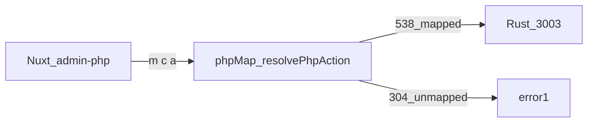

# 2026-08-31 执行稿：Admin 缺口与下一轮接法

下一轮 **按本文实现**，不要再重新盘点一遍。摘要见 [ADMIN_PROGRESS.md](../ADMIN_PROGRESS.md)。不双写 `.cursor/plans/`。

扫描日：2026-08-31。规则对齐 [`web/apps/admin/app/utils/phpMap.ts`](../../web/apps/admin/app/utils/phpMap.ts) 的 `resolvePhpAction`：非 `index` 先精确 `PHP_ADMIN_MAP[m/c/a]`，再 `MODULE_ROUTES` 的 `del`/`delete`/`save`/`add`/`status`/`audit`/`checkstate`；`index` 先精确再 MODULE `list`。从 `web/apps/admin/app` 的 `httpPost('m=…')` 与 `uri + 'c&a='` 抽出请求。未把扫描 JSON 提交进仓库。

## 1. 进度

| 项 | 数 |
|---|---|
| PHP 控制器 `uploads/admin/model/*.class.php` | **120** 文件，约 **945** 个 `*_action` |
| Nuxt path 页 `web/apps/admin/app/pages/*.vue` | **121**（对齐 PHP `router.js`，骨架已齐） |
| `PHP_ADMIN_MAP` 精确键 | **597** |
| `MODULE_ROUTES` | **102**（含 `index/getIpAddress` 等别名；业务控制器约 90） |
| Vue 抽出的 `m/c/a` 去重 | **842** |
| 其中已能 resolve | **538**（**63.9%**） |
| 仍未映射 | **304** 条，**77** 个 `m/c` |
| 抽出字符串条数（含重复） | 1023；resolve 种类：exact 503、exact-index 89、module-index 38、module-del 17、module-save 11、module-status 8、module-add 6 |

**页齐、接口未齐。** 缺的不是菜单，而是具名 `m/c/a` 有没有打到正确 Rust。

未映射时 [`httpPost.ts`](../../web/apps/admin/app/utils/httpPost.ts) 返回 `{error:1, msg:"未映射的后台接口: …"}`。列表若只在 `error==0` 时 `loading=false`，会一直转圈。



调用链：`httpPost` → phpMap → BFF `/api/proxy` → **`:3003`** `POST /v1/admin/*`。没有万能 invoke。业务只写 **jobs**。systemd `:3000`（库 phpyun）禁止 kill/重启/替换。

## 2. 已完成（勿再迁页面）

以 ADMIN_PROGRESS 为准，主路径多数已精确映射：

- 企业开户/编辑/企业 Imitate/套餐、职位列表与推广、简历/会员 add-edit-save
- 招聘会/新闻/问答/专题/公招/广告/财务/微聘/兼职/名企/单页
- 职位分类与城市/行业等 `cat-class`
- 会员 CRM **列表**：`user-gap` 的 mem-index / logout-index / appeal-index / login-index / memlog-index（及 login-del / memlog-del）
- wangEditor、关键词布尔开关、`memNum`（`admin_member/memNum`）

刻意不做：猎头、spview、完整校园/培训（uploads 无后台源码）、卸 php-fpm、删 `uploads/`。`database` / `generate_*` / `admin_uc` 破坏性写须用户再点头。

## 3. 未映射名单（Vue 已调用）

`system/` + `index` 多半是 `uri` 拼接噪声，可忽略。其余按 `m/c`，括号内为 action。

### 会员 / 个人

- `user/admin_member`（10）：Imitate, lock, editSave, del, reset_pw, send, msgsave, checksitedid, getIpAddress, getMobileAddress
- `user/admin_appeal`（3）：info, success, del
- `user/admin_member_logout`（3）：status, del, memNum
- `user/users_member`（11）：checksitedid, delwflog, jobSqLog, log, logDel, merge, payLog, searchCom, usercert, writtenOffLog, yqmsLog
- `user/users_resume`（8）：delResume, delResumeFb, export_check, label, rec, refresh, resumePreview, top
- `user/users_userlog`（6）：deldown, delfreedown, dellook, delSxLog, deltalentpool, deltrust
- `user/users_trust`（5）：del, directrecom, recom, status, trustNum
- `user/users_msg`（4）：lockinfo, msgedit, msgshow, status
- `user/users_userset`（4）：logo, saveLogo, saveSpend, userspend
- `user/users_usercert`（3）：del, getSfStatist, sbody
- `user/users_pic`（1）：getShowStatist

### 企业 / 职位

- `user/company`（19）：addTuiWenTask, adminLogoHb, bindPackage, checkguwen, checksitedid, delLog, delStatisDetail, delwflog, export_check, getacbindstatus, log, mcomtpl, msettpl, mwhb, savefact, setLogo, setupcom, statisDetail, writtenOffLog
- `user/company_job`（14）：addTuiWenTask, ajaxCloseReserve, closeReserve, depower, getJobHtml, getRefresh, reserveJob, saveAddress, saveclass, setlinkopen, upjobhits, upReserveJob, whb, xls
- `user/company_comlog`（7）：delfavjob, deljobtellog, dellookjob, delpartapply, deluseridjob, deluseridmsg, jobtellog_search_list
- `user/company_order`（5）：del, edit, htpic_del, upload, uploadsave
- `user/company_cert`（4）：del, getCertStatist, getConfigData, sbody
- `user/company_comrating`（4）：ajax, delpic, edittc, zzData
- `user/company_comset`（4）：comspend, logo, rating, saveComspend
- `user/company_pic`（4）：getBannerStatist, getBannerStatusBody, getHjStatist, getLogoStatist
- `user/company_interview`（3）：delYqmb, save, status
- `user/company_news`（3）：del, getNewsStatist, statusbody
- `user/company_product`（3）：del, getProductStatist, statusbody
- `user/weipin_once`（2）：checksitedid, onceNum
- `user/weipin_tiny`（2）：checksitedid, tinyNum
- `user/company_company`（1）：compreview
- `user/company_job_refresh_log`（1）：delSxLog
- `user/company_pay`（1）：del
- `user/partjob`（1）：partNum

### 系统

- `system/set_tplset`（9）：comptplsave, comtpldel, indextpldel, indextplsave, pcindextpl, resumetpl, resumetpldel, resumetplsave, stylesave
- `system/set_integral`（8）：ajax, class, comjifen, del, index, lietou_save, save, saveSet
- `system/set_navigation`（6）：navset, navsort, type, typeadd, typedel, typename
- `system/domain_group`（5）：adminInfo, delGroup, groupInfo, groupList, saveGroup
- `system/admin_nav`（4）：changeDisplay, del, info, version
- `system/domain_list`（3）：changeDomainType, configSave, getDomainCache
- `system/role_myuser`（3）：delAdminQyUserId, delAdminWxBind, qwcallback
- `system/role_ugroup`（3）：del, info, save
- `system/set_config`（3）：save_logo, savetplcache, settplcache
- `system/set_module`（3）：getseo, navset, navsetSave
- `system/singleclass`（3）：add, ajax, del
- `system/warning`（3）：config, del, getWarningConfig
- `system/set_friendlink`（2）：getInfo, sitedid
- `system/set_navmap`（2）：getTypes, nav_xianshi
- `system/category_job_class`（1）：clearpinyin
- `system/info_systeminfo`（1）：del
- `system/role_user`（1）：del
- `system/set_cron`（1）：delLog
- `system/set_guanjianci`（1）：state

说明：`set_integral/index`、`set_integral/save` 未进 `PHP_ADMIN_MAP`，且无 MODULE，故 index/save 也算未映射（不要靠启发式）。

### 工具

- `tool/fabutool`（13）：Getpubtool, comtwTask, comtwTask_base_data, delTwTask, getComBySearch, getComTW, getTW, getWxpubJob, pubtool, taskFinish, twTask, twTask_base_data, wxPubTemp
- `tool/database`（8）：backIn, backUp, clearData, delBack, getBackFile, getDbTable, getOptTable, optimizeTable
- `tool/generate_page`（6）：all, archive, baseData, news, newsclass, once
- `tool/weixinrecord`（5）：clearwx, delkeyword, deluser, keyword, userbd
- `tool/dataCall`（4）：delCall, getPreviewData, saveCall, upCall
- `tool/dataCollection`（4）：getPartCache, getRating, getUserCache, setLocoyConfig
- `tool/dataRecycle`（4）：delRecycle, recover, recoverAll, tuncateRecycle
- `tool/dataBoard`（3）：class, fenxiabiao, getAuth
- `tool/emailset`（3）：delconfig, savetplconfig, tplswitch
- `tool/messageset`（3）：gettpl, savetpl, tplswitch
- `tool/admin_uc`（2）：pwsave, ucsave
- `tool/emaillog`（2）：del, repeat
- `tool/gsdConfig`（2）：getRestNum, setPhoneAddressConfig
- `tool/messagelog`（2）：del, repeat
- `tool/generate_cache`（1）：cache
- `tool/generate_xml`（1）：archive

`MODULE_ROUTES` 里 `tool/database` 的 list 映回收站、`generate_*` 映清缓存，**具名 action 仍未映射或会打错口**。

### 运营 / 内容

- `yunying/yingxiao_hrlog`（7）：datashowset, datashowsetSave, editsave, getHb, rehrlog, set, setSave
- `yunying/yingxiao_tuiguang`（6）：getBirthday, getcom, getjob, getuser, sendjob, sendresume
- `yunying/report_ask`（6）：del, delquestion, edit, getclass, save, saveresult
- `yunying/report_resume`（5）：del, delresume, delresumeall, saveresult, saveresultall
- `yunying/shop_reward`（3）：getclass, hot, rec
- `yunying/report_advise`（2）：del, saveresult
- `yunying/shop_class`（2）：ajax, up
- `yunying/yingxiao_hbconfig`（2）：delWhb, saveWhb
- `yunying/report_job`（1）：saveresult
- `yunying/shop_list`（1）：del
- `yunying/shop_set`（1）：saveset
- `neirong/news`（3）：ajax_menu, make_cache, set_menu
- `neirong/zph_space`（3）：ajax, ajaxspace, up

## 4. 每波统一约定（实现时）

- 规格只读 PHP：`uploads/admin/model/...`，不改 `uploads/`
- 新具名 action 走 `POST /v1/admin/php-content/{module}/{action}`，**不进 AdminDoc**（快照仍 297）
- SQL 在 repo；service 组 PHP 信封。写操作多为 `error=0` + `msg`（`PhpOut::Message`）；列表/详情为 `PhpOut::Data`
- 只写 **jobs**；编译：`TMPDIR=/var/tmp/cargo-tmp CARGO_TARGET_DIR=phpyun-rs/target cargo build -p phpyun-rs --offline -j 1`
- 启动 debug：`PHPYUN_ENV_FILE=.../phpyun-rs/.env BIND=127.0.0.1:3003 METRICS_BIND=127.0.0.1:9091`
- 禁止动 systemd `:3000` / pid 长期 `896785`
- phpMap **精确键**；admin：`ADMIN_ASSET_TAG=$(git rev-parse --short HEAD) pnpm --filter @phpyun/admin build`，只重启 cwd=`web/apps/admin` 的 `:3002`
- 每小块中文 commit + push；列出将改文件；php-content action 名 slug：字母数字、`-`、`_`

## 5. 波次 1 — 会员 CRM 写（下一轮先做）

列表已通。本波接 **alluser / shensu / logoff 上的按钮**。

### 5.1 `admin_member`：Imitate / lock / editSave / del

| 项 | 内容 |
|---|---|
| PHP | [`uploads/admin/model/user/admin_member.class.php`](../../uploads/admin/model/user/admin_member.class.php) `Imitate_action`（约 599）、`lock_action`（134）、`editSave_action`（99）、`del_action`（182） |
| Vue | [`alluser.vue`](../../web/apps/admin/app/admin-php/user/member/component/alluser.vue)：`getMemberUrl` 读 `res.data.url`；lock/editSave/del 读 `res.data.error` / `msg`。[`shensu.vue`](../../web/apps/admin/app/admin-php/user/member/component/shensu.vue) 也会 `admin_member&a=del` |
| phpMap | `user/admin_member/Imitate`、`lock`、`editSave`、`del` → `phpContent('user-gap', …)` |
| 不要 | 不要把会员 Imitate 映到已有 [`/v1/admin/companies/php-imitate`](../../phpyun-rs/crates/products/recruit/api-admin/src/v1/companies.rs)（企业开户模仿；body 字段是 `type` 不是 `utype`） |

PHP 逻辑：

- **Imitate**：按 uid 取 member，PHP 写会员 cookie，返回 `{url: sy_weburl + '/member'}`。Rust 无法写 PHP cookie；对齐企业 imitate：校验 uid 存在，返回前台会员 URL（可用 `sy_weburl` + `/member`）。Vue 只 `window.open(res.data.url)`。
- **lock**：`uid` + `status` + `lock_info` → `userinfo->lock`。成功 `error=0`。
- **editSave**：`uid/usertype/username/password/moblie/email/reg_ip/did/status` → `upMemberInfo`。成功 `error=0`。
- **del**：`del` 为 uid 或数组 → `delMember`。成功 `error=0`。

Rust 落点建议：`admin_php_content_service` 的 `user-gap`：`mem-imitate` / `mem-lock` / `mem-edit` / `mem-del`。SQL 放 [`user/repo.rs`](../../phpyun-rs/crates/products/recruit/models/src/user/repo.rs)（已有按 uid 更新 status/lock_info/username 的语句可复用，对照后再用）。

验证：curl `user-gap/mem-imitate` 带 uid，信封 `data.url` 非空；lock 后 mem-index 该行 `status=2`；`:3000` pid 不变。

同波可顺手精确映射（已有实现、只差键）：

- `user/admin_member/reset_pw` → 现成 `phpContent('user-gap', 'reset-password')`（PHP 把密码设为 `123456`）

`send` / `msgsave` / `checksitedid` / IP 归属本波不做，列入会员剩余。

### 5.2 `admin_appeal`：info / success / del

| 项 | 内容 |
|---|---|
| PHP | [`admin_appeal.class.php`](../../uploads/admin/model/user/admin_appeal.class.php) `info_action`（45）、`success_action`（60）、`del_action`（74） |
| Vue | [`shensu.vue`](../../web/apps/admin/app/admin-php/user/member/component/shensu.vue) |
| phpMap | `user/admin_appeal/info`、`success`、`del` |

PHP 逻辑：

- **info**：`id`（uid）→ member `info` + `getUserInfo`，返回 `{user, info}`，日期字段 `login_date_ymd` / `reg_date_ymd`。
- **success**：`id` → `appealstate=2`。成功 `error=0`。
- **del**：`del` 数组或 `id` → 清空 `appeal/appealtime`，`appealstate=1`（不是删 member 行）。

Rust：`user-gap/appeal-info`、`appeal-success`、`appeal-del`。列表仍走 `appeal-index`。

验证：info 返回 `data.info.uid`；success 后面列表 `appealstate=2`。

### 5.3 `admin_member_logout`：status / del / memNum

| 项 | 内容 |
|---|---|
| PHP | [`admin_member_logout.class.php`](../../uploads/admin/model/user/admin_member_logout.class.php) `status_action`（63）、`del_action`（78）、`memNum_action`（101） |
| Vue | [`logoff.vue`](../../web/apps/admin/app/admin-php/user/member/component/logoff.vue)：`shenheNumber` 在 `error==0` 时 `_this.memNum = res.data`，模板用 `memNum.count` |
| phpMap | `user/admin_member_logout/status`、`del`、`memNum` |

PHP 逻辑：

- **status**：`id` → `logout->status`（审核通过并销号，对照 PHP model）。
- **del**：`id` 或 `del` → `logout->del`（删申请，不一定销号）。
- **memNum**：[`logout.model.php` `getListNumV1`](../../uploads/app/model/logout.model.php) → `{count: 全表条数, weishenhe: status=1}`。**普通信封**（与 `admin_member/memNum` 一样走 phpContent，不要 rawBody）。不要和 `user-gap/mem-num`（pid=0 会员统计）混用。

Rust：`user-gap/logout-status`、`logout-del`、`logout-num`。SQL 在 [`member_logout/repo.rs`](../../phpyun-rs/crates/products/recruit/models/src/member_logout/repo.rs)。

`MODULE_ROUTES` 的 `user/admin_member` **没有** `del`/`status`，不要指望启发式。logout **没有** MODULE 行。

验证：curl `logout-num` 得 `data.count`；status/del 后列表条数变化。

### 5.4 波次 1 文件清单（实现时）

- `web/apps/admin/app/utils/phpMap.ts`
- `phpyun-rs/.../admin_php_content_service.rs`（dispatch + handler）
- `phpyun-rs/.../user/repo.rs` 和/或 `member_logout/repo.rs`
- `doc/ADMIN_PROGRESS.md` 一行勾选

## 6. 波次 2 — 简历列表写

列表已走 `/v1/admin/resumes`。具名写操作未映射。

| 项 | 内容 |
|---|---|
| PHP | [`users_resume.class.php`](../../uploads/admin/model/user/users_resume.class.php) `refresh_action`（1097）、`rec_action`（1121）、`top_action`（1143）、`label_action`（1199）、`delResume_action`（1220）；另有 `delResumeFb`（简历分块删除） |
| Vue | [`resumeall.vue`](../../web/apps/admin/app/admin-php/user/users/component/resumeall.vue) |
| phpMap | `user/users_resume/delResume`、`refresh`、`rec`、`label`、`top`、`delResumeFb` |

PHP：成功 `admin_json(0, msg)`。`delResume` 带 `del` + 可选 `delAccount`。`refresh` 用 `id` 或 `ids`。`rec` 用 `id` + `rec`。

Rust：`php-content/resume/` 下 del / refresh / rec / label / top（已有 skill/project/other，同模块加 action）。不要把 `delResume` 误打 MODULE `users_resume.status`。

`export_check` / `resumePreview` 本波可后做。

## 7. 波次 3 — 企业剩余写（拆小）

不要一次做完 19 个。优先三件，PHP [`company.class.php`](../../uploads/admin/model/user/company.class.php)：

- `writtenOffLog_action`（2026）
- `log_action`（2111）
- `checksitedid_action`（1330）

phpMap：`user/company/writtenOffLog`、`log`、`checksitedid`。对照 PHP 返回信封后再接。`export_check` / 海报 / 推文更后。

`user/company/del` 已由 MODULE `del` 映到企业 status，不要再改启发式。

## 8. 波次 4+ 与须点头

- 系统：`set_tplset`、`set_integral`、导航 type、分站 group
- 工具：`fabutool` 13 个、微信记录、dataCall save、回收站 recover
- 运营：推广/HR 设置、举报 `saveresult`
- **须再点头**：`tool/database` 备份恢复、`generate_*`、`admin_uc`
- **做不到**：猎头、spview、完整校园/培训业务后台

另已排队、与具名 action 无关：兼职/once 图片上传（现 `upload_not_supported`）、`ajaxpinyin` 未转拼音、matching 未按职位城市学历滤、支付沙箱真单。

## 9. 实现时验证模板

```bash
# 只动 debug
TMPDIR=/var/tmp/cargo-tmp CARGO_TARGET_DIR=/www/wwwroot/zzzz.com/phpyun-rs/target \
  cargo build -p phpyun-rs --offline -j 1
# 重启仅 :3003 的 target/debug/phpyun-rs
TOKEN=$(python3 -c 'import json,urllib.request; print(json.load(urllib.request.urlopen("http://127.0.0.1:3003/dev/token"))["tokens"]["admin"])')
curl -sS -X POST http://127.0.0.1:3003/v1/admin/php-content/user-gap/mem-imitate \
  -H "Authorization: Bearer $TOKEN" -H 'content-type: application/json' \
  -d '{"uid":1,"utype":1}'
ps -p 896785 -o pid,cmd   # 必须仍在
```

Admin 重建后只杀 cwd=`web/apps/admin` 的 `:3002`。
